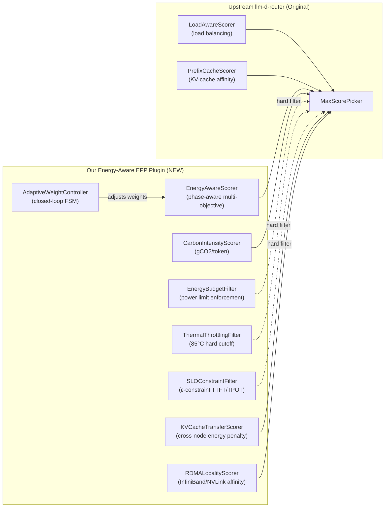
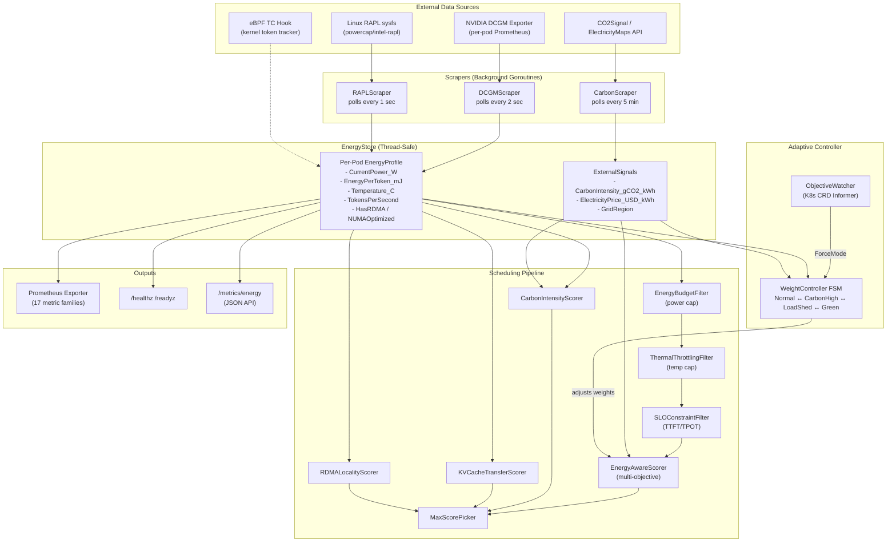
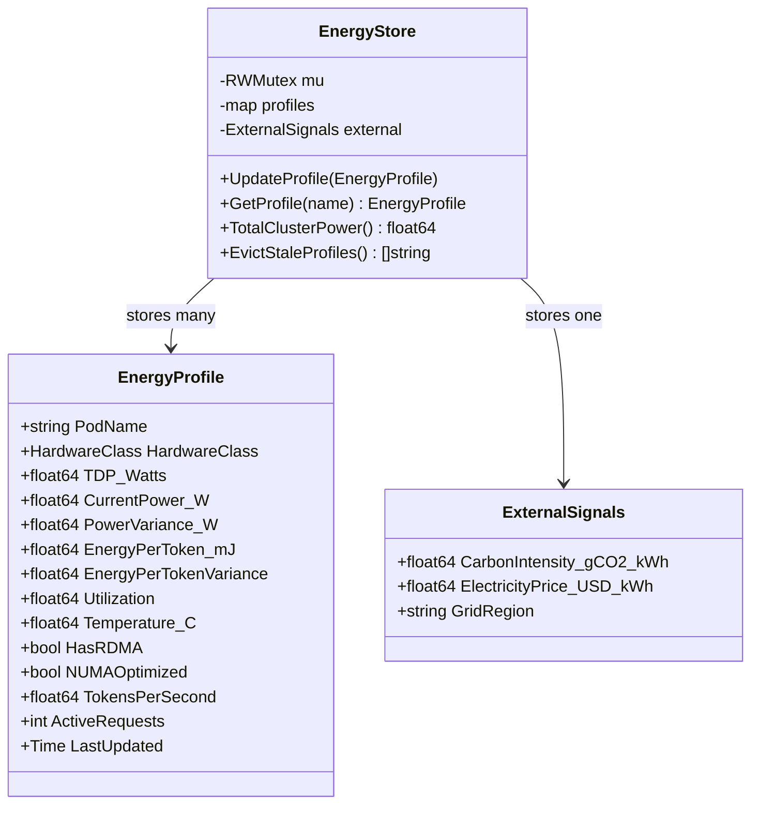
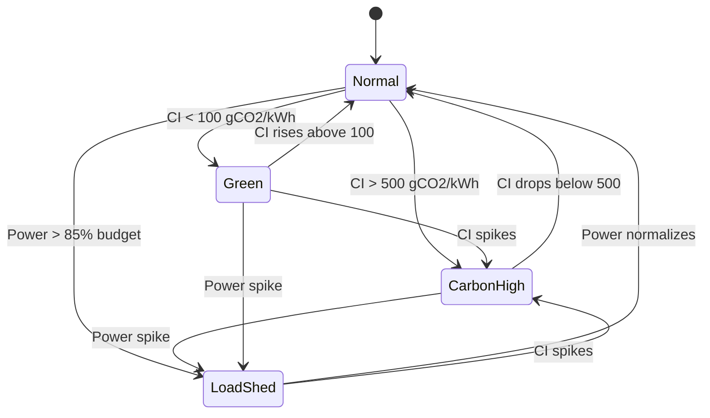
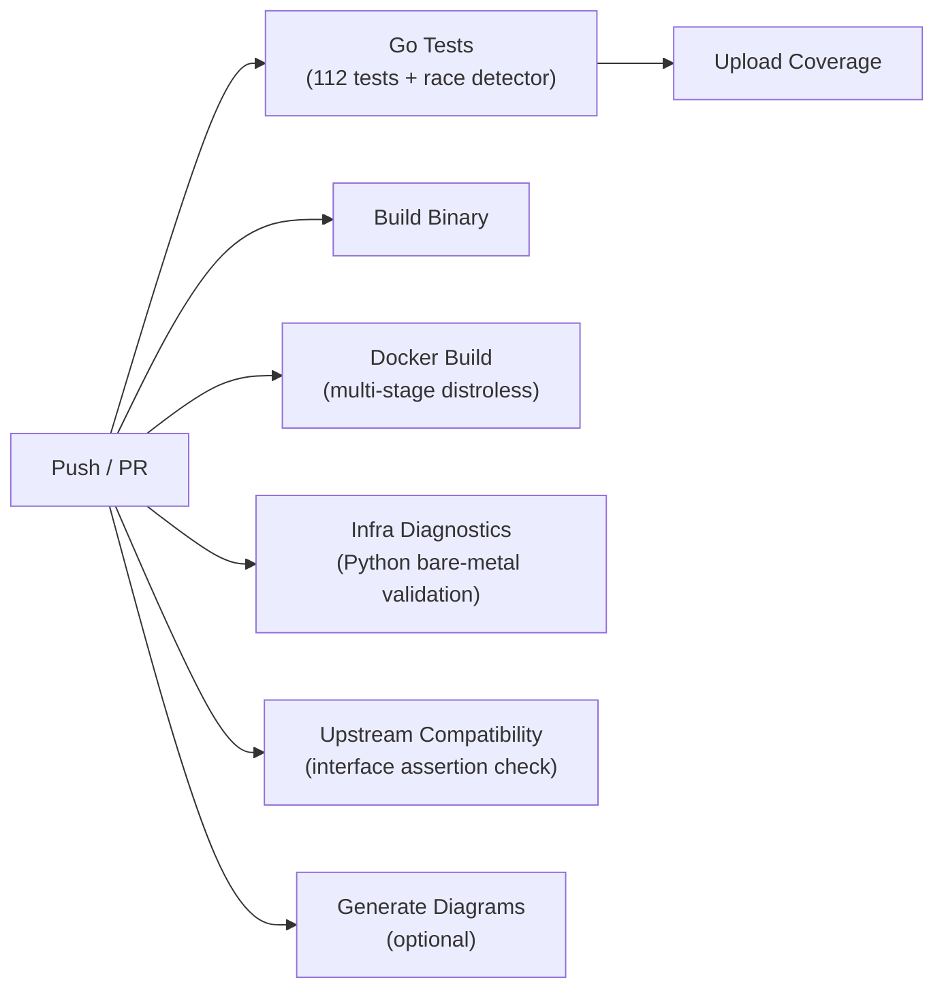
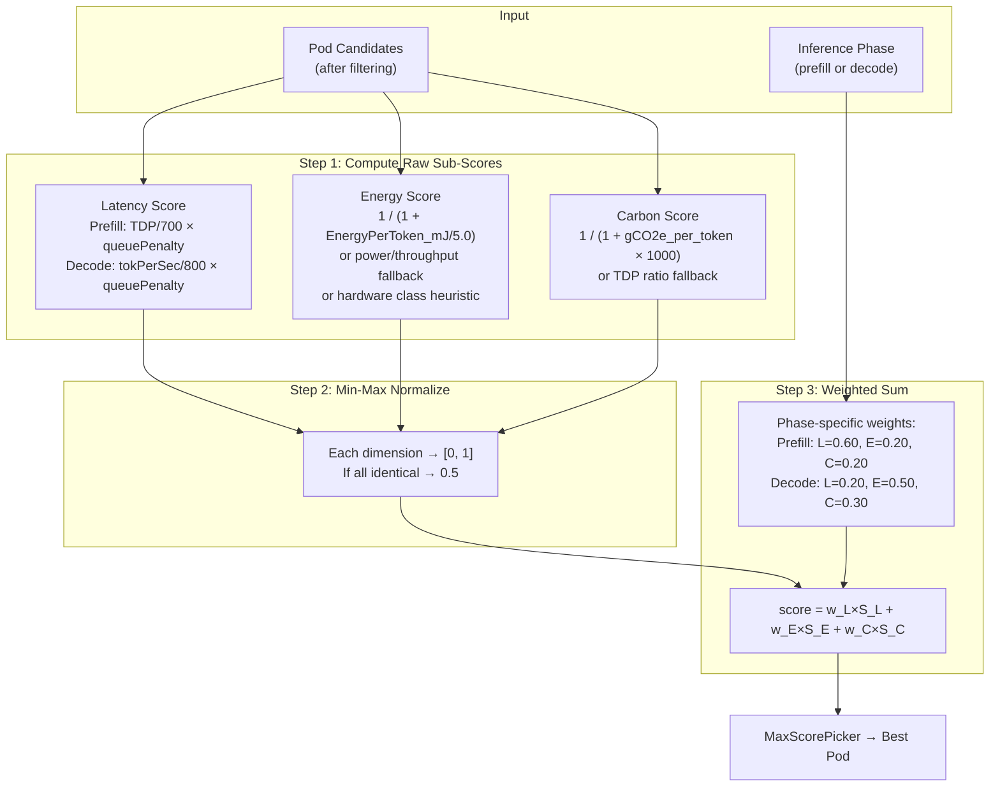

# Energy-Aware Token-Level Routing for Heterogeneous LLM Inference

> **Proposal and Implementation** - Design, Implementation, and Evaluation of an LLM-D Endpoint Picker Plugin

Take a look of the thesis/research report here: [Open Report](Johnnie_Yan_Ho_Tse_Energy_Aware_Token_Level_Routing_for_Heterogeneous_LLM_Inference_in_Kubernetes_Research_Paper.pdf)

An energy-aware endpoint picker plugin (EPP) for the [llm-d inference scheduler](https://github.com/llm-d/llm-d-inference-scheduler) on Kubernetes. Enables **token-level, phase-aware routing** that dynamically directs Prefill and Decode phases to heterogeneous hardware (high-performance GPUs vs. low-power ASICs) to optimize for energy efficiency, carbon footprint, and total cost of ownership.

**Integrated with** [Gateway API Inference Extension (GIE) v1.5.0](https://github.com/kubernetes-sigs/gateway-api-inference-extension) - implements the real `scheduling.Filter` and `scheduling.Scorer` interfaces for production deployment.

## 🚀 AI Infrastructure & Automation Highlights

Designed with large-scale data center operations in mind, this project demonstrates hands-on expertise across modern AI infrastructure stacks:

- **Linux Kernel eBPF Telemetry:** Zero-overhead network payload tracking via custom Linux TC BPF hooks, bypassing user-space Prometheus overhead.
- **High-Performance Networking & Locality:** Integrated GPU-Direct RDMA and InfiniBand/RoCE topological scoring for zero-copy KV-cache transfers.
- **Slurm & KubeRay Interoperability:** SPANK adapters and Autoscaler policies to force power-capped scheduling across classic HPC bare-metal and dynamic Kubernetes Ray environments.
- **Thermal & Power Automation:** Hard closed-loop telemetry filtering (e.g., mitigating hotspots >85°C) mapped back to a Kubernetes `client-go` Informer for dynamic CRD (`InferenceObjective`) reconciliation.
- **Comprehensive Test Engineering:** Bulletproof CI/CD pipelines featuring **112 unit and end-to-end simulation tests** across 8 packages, high-precision mathematical stability proofs (Welford's Algorithm), and Bare-Metal Python diagnostics.

## Key Results

### Phase-Aware Routing (E2E Simulation - 1,000 cycles)

| Phase | Winner | Win Rate | Rationale |
|-------|--------|----------|-----------|
| **Prefill** | GPU H100 | **99.8%** | Latency-dominant weights favor high FLOPS |
| **Decode** | ASIC QC-100 | **100.0%** | Energy-dominant weights favor efficiency |

### Token Economics

| Metric | GPU H100 | ASIC QC-100 | Ratio |
|--------|----------|-------------|-------|
| Power | 550W | 50W | 11.0× |
| Energy/1M tokens | 0.191 kWh | 0.033 kWh | **5.8×** |
| Carbon/1M tokens | 74.5 gCO2 | 13.5 gCO2 | **5.5×** |
| Cost/1M tokens | $0.019 | $0.004 | **5.5×** |
| **SCI Score** | **0.0194 gCO2/req** | **0.0037 gCO2/req** | **5.2×** |

### Adaptive Weight Controller

| Mode | Trigger | Decode Weights (L/E/C) | Effect |
|------|---------|----------------------|--------|
| **Normal** | Default | 0.20 / 0.50 / 0.30 | Balanced |
| **Carbon High** | CI > 500 gCO2/kWh | 0.05 / 0.38 / **0.57** | Aggressively favor ASICs |
| **Load Shed** | Power > 85% budget | 0.01 / **0.82** / 0.16 | Maximum energy efficiency |
| **Green** | CI < 100 gCO2/kWh | **0.41** / 0.47 / 0.12 | Allow latency-optimized GPU routing |

## Architecture


### Scheduling Pipeline for LLM Inference EndPoint Picker


### Adaptive Weight Controller FSM


### GIE Integration Architecture


Our plugin implements the real Gateway API Inference Extension interfaces:

| Adapter | GIE Interface | Wraps | Category |
|---------|--------------|-------|----------|
| `GIEFilterAdapter` | `scheduling.Filter` | `EnergyBudgetFilter` | Hard constraint |
| `GIEFilterAdapter` | `scheduling.Filter` | `ThermalThrottlingFilter` | Hard constraint |
| `GIEScorerAdapter` | `scheduling.Scorer` | `EnergyAwareScorer` | Distribution |
| `GIECarbonScorerAdapter` | `scheduling.Scorer` | `CarbonIntensityScorer` | Distribution |
| `GIERdmaScorerAdapter` | `scheduling.Scorer` | `RDMALocalityScorer` | Affinity |

### Telemetry Concurrency Model


## Project Structure

```
.
├── cmd/
│   └── energy-epp/
│       └── main.go                    # Binary (standalone demo + sidecar mode)
├── pkg/
│   ├── signals/
│   │   ├── types.go                   # Core types: HardwareClass, EnergyProfile, WeightVector
│   │   ├── energy_store.go            # Thread-safe telemetry store + stale eviction
│   │   ├── sci_calculator.go          # ISO SCI score (Green Software Foundation)
│   │   └── *_test.go
│   ├── plugins/
│   │   ├── scorer/
│   │   │   ├── energy_aware_scorer.go # Phase-aware multi-objective scoring
│   │   │   ├── carbon_intensity_scorer.go
│   │   │   └── *_test.go
│   │   ├── filter/
│   │   │   ├── energy_budget_filter.go
│   │   │   └── *_test.go
│   │   └── scraper/
│   │       ├── dcgm_scraper.go        # NVIDIA GPU metrics via Prometheus
│   │       ├── rapl_scraper.go        # CPU energy counters via sysfs
│   │       ├── carbon_api_scraper.go  # CO2Signal / ElectricityMaps
│   │       └── *_test.go
│   ├── config/
│   │   ├── energy_config.go           # Master config + plugin suite factory
│   │   ├── plugin_registry.go         # Standalone adapter layer (Filter + Scorer)
│   │   ├── scheduling_profile.go      # GIE scheduling profile orchestrator
│   │   ├── gie_adapter.go             # ★ Real GIE v1.5.0 interface adapters
│   │   └── config_test.go
│   ├── adaptive/
│   │   ├── weight_controller.go       # Closed-loop adaptive weight adjustment
│   │   └── weight_controller_test.go
│   ├── metrics/
│   │   ├── prometheus_exporter.go     # 17 custom Prometheus metric families
│   │   └── prometheus_exporter_test.go
│   └── simulation/
│       └── e2e_simulation_test.go     # 1000-cycle full-pipeline simulation
├── pkg/
│   ├── ebpf/                          # eBPF kernel-level token tracker
│   ├── slurm/                         # Slurm SPANK adapter for HPC
│   └── ray/                           # KubeRay carbon-aware autoscaler
├── deploy/
│   ├── kind/
│   │   ├── kind-config.yaml
│   │   └── setup-cluster.sh           # Bootstrap + simulated vLLM pods
│   ├── manifests/
│   │   ├── energy-epp-config.yaml
│   │   └── heterogeneous-pool.yaml
│   └── grafana/
│       └── energy-epp-dashboard.json  # 13-panel Grafana dashboard
├── docs/
│   └── diagrams/                      # ★ Generated architectural diagrams
├── benchmarks/
│   ├── profiles/hardware_profiles.yaml
│   └── scripts/
│       ├── analyze_results.py
│       └── run-experiments.sh
├── Dockerfile                         # Multi-stage distroless build
├── Makefile                           # 25 targets
├── go.mod                             # Go 1.25.7 + GIE v1.5.0 dependency
└── README.md
```

## Quick Start

```bash
# Run all tests (112 tests across 8 packages, 0 race conditions)
go test -race -count=1 ./...

# Build and run standalone demo
make demo

# Run in sidecar mode (serves /healthz, /readyz, /metrics/prometheus)
make sidecar

# Run 1000-cycle end-to-end simulation
go test -race -v -count=1 ./pkg/simulation/...

# Generate coverage report
make test-cover

# Deploy to Kind cluster (requires kind, kubectl, docker)
make kind-setup
```

## Dependencies

| Dependency | Version | Purpose |
|-----------|---------|---------| 
| Go | 1.25.7+ | Language runtime |
| `sigs.k8s.io/gateway-api-inference-extension` | v1.5.0 | GIE scheduling interfaces |
| `k8s.io/apimachinery` | v0.35.3 | Kubernetes types |
| `sigs.k8s.io/controller-runtime` | v0.23.3 | Controller utilities |

## Phase-Aware Scoring

The core innovation is **asymmetric weight vectors** for Prefill vs Decode:

| Phase | Latency Weight | Energy Weight | Carbon Weight |
|-------|---------------|---------------|---------------|
| **Prefill** | 0.60 | 0.20 | 0.20 |
| **Decode** | 0.20 | 0.50 | 0.30 |

This means:
- **Prefill** (compute-bound): Routes to high-FLOPS GPUs for minimum TTFT
- **Decode** (memory-bound): Routes to low-power ASICs for minimum energy-per-token

## ISO SCI Score (Software Carbon Intensity)

Following the [Green Software Foundation ISO 21031](https://sci.greensoftware.foundation/) standard:

**SCI = ((E × I) + M) / R**

| Component | GPU H100 | ASIC QC-100 |
|-----------|----------|-------------|
| E (energy/request) | 48.9 μWh | 9.3 μWh |
| I (grid intensity) | 390 gCO2/kWh | 390 gCO2/kWh |
| M (embodied/request) | 0.38 mgCO2 | 0.10 mgCO2 |
| **SCI** | **19.4 mgCO2/req** | **3.7 mgCO2/req** |

On clean grids (e.g., France nuclear @ 55 gCO2/kWh), embodied carbon dominates at 88.6%.

## Supported Hardware

| Accelerator | Class | TDP | Decode mJ/tok | Prefill ms/tok |
|-------------|-------|-----|---------------|----------------|
| NVIDIA H100 SXM5 | GPU_HIGH_PERF | 700W | 0.625 | 0.0012 |
| NVIDIA A100 (capped) | GPU_MED_PERF | 200W | 0.267 | 0.0017 |
| NVIDIA L4 | GPU_MED_PERF | 72W | 0.200 | 0.0050 |
| Qualcomm Cloud AI 100 | ASIC_LOW_POWER | 75W | 0.138 | 0.0029 |
| Intel Gaudi2 | ASIC_LOW_POWER | 600W | 0.486 | 0.0014 |

## Test Coverage

| Package | Tests | Coverage |
|---------|-------|----------|
| `pkg/signals` | 25 | 100.0% |
| `pkg/plugins/scorer` | 24 | 94.7% |
| `pkg/plugins/scraper` | 22 | 87.2% |
| `pkg/config` | 17 | 91.8% |
| `pkg/plugins/filter` | 14 | 96.3% |
| `pkg/adaptive` | 6 | 85.8% |
| `pkg/metrics` | 2 | 98.2% |
| `pkg/simulation` | 2 | E2E |
| **Total** | **112** | **~93%** |

## Sidecar Endpoints

| Endpoint | Method | Description |
|----------|--------|-------------|
| `/healthz` | GET | Health status + adaptive mode + stale count |
| `/readyz` | GET | Readiness probe |
| `/metrics/energy` | GET | JSON: profiles, external signals, adaptive mode |
| `/metrics/prometheus` | GET | 17 Prometheus metric families (text format) |

---

## 📖 Comprehensive Repository Guide

This section provides a complete, in-depth guide to **every directory and file** in the repository so that anyone can understand the full codebase.

---

### 🔍 What This Project Does to the llm-d-router (Upstream)

The upstream [llm-d-router](https://github.com/llm-d/llm-d-router) (formerly "llm-d inference scheduler") is the intelligent entry point for LLM inference traffic in Kubernetes. It routes requests to backend vLLM/TGI pods using an **Endpoint Picker (EPP)** that integrates with Envoy via the `ext-proc` protocol. Out of the box, the llm-d-router supports **load-aware scoring** (route to least-loaded pod) and **prefix-cache scoring** (route to pod with KV-cache hit), but it has **zero awareness of energy, carbon, or power**.

**This project extends the upstream llm-d-router by adding an entirely new dimension: energy-aware routing.** Specifically:



#### How We Integrate (Two Approaches)

| Approach | Directory | Description |
|----------|-----------|-------------|
| **Standalone Plugin** | `pkg/` | Full-featured Go packages with internal EnergyStore, adapters, and test infrastructure. Can run as a standalone sidecar binary alongside the llm-d-router. |
| **Upstream-Portable Scorer** | `upstream-port/` | A single-file, self-contained scorer (`energy_aware.go`) that directly implements the upstream `scheduling.Scorer` interface. Ready to be dropped into a fork of `llm-d-router` and registered via `Factory()`. |

#### What We Add That Upstream Lacks

| Capability | Upstream llm-d-router | Our Plugin |
|------------|----------------------|------------|
| **Phase-aware scoring** | No (same weights for prefill & decode) | ✅ Asymmetric weight vectors per phase |
| **Energy telemetry** | None | ✅ Real-time DCGM + RAPL scraping |
| **Carbon intensity** | None | ✅ CO2Signal/ElectricityMaps integration |
| **Power budget enforcement** | None | ✅ Cluster-wide watt cap filter |
| **Thermal protection** | None | ✅ 85°C hard cutoff filter |
| **SLO constraints (ε-constraint)** | None | ✅ TTFT/TPOT hard filters |
| **Adaptive weight control** | None | ✅ 4-mode FSM (Normal/CarbonHigh/LoadShed/Green) |
| **ISO SCI scoring** | None | ✅ Full ISO 21031 implementation |
| **RDMA/InfiniBand awareness** | None | ✅ NUMA-topology scoring |
| **KV-cache transfer energy** | None | ✅ Cross-node energy penalty model |
| **eBPF telemetry** | None | ✅ Zero-overhead kernel TC hooks |
| **Slurm HPC integration** | None | ✅ SPANK adapter for bare-metal |
| **KubeRay autoscaler** | None | ✅ Carbon-aware scale-up policies |
| **Prometheus metrics** | Basic | ✅ 17 custom energy metric families |
| **CRD reconciliation** | InferenceObjective (priority/rewrite only) | ✅ InferenceObjective → adaptive mode |

The upstream router uses a **plugin architecture** where `Filter` and `Scorer` plugins are registered via factory functions and composed into `SchedulingProfiles`. Our `upstream-port/energy_aware.go` follows this exact pattern — it exports a `Factory()` function, implements `scheduling.Scorer`, and reads energy telemetry from pod labels set by our DCGM exporter sidecar.

---

### 🧭 High-Level Data Flow Diagram



---

### 📁 Complete Directory & File Reference

#### Root-Level Files

| File | Purpose |
|------|---------|
| `README.md` | This file — project overview and comprehensive guide |
| `go.mod` / `go.sum` | Go module definition; declares dependencies including GIE v1.5.0, K8s apimachinery, controller-runtime |
| `Makefile` | 25+ build targets: `demo`, `sidecar`, `test`, `test-cover`, `kind-setup`, `docker-build`, etc. |
| `Dockerfile` | Multi-stage build: Go 1.25-alpine builder → `gcr.io/distroless/static-debian12:nonroot` runtime |
| `LICENSE` | Apache License 2.0 |
| `CONTRIBUTING.md` | Contribution guidelines and PR template instructions |
| `QUICKSTART.md` | Step-by-step quick start guide |
| `TESTING_REPORT.md` | Detailed test results and coverage analysis |
| `.gitignore` | Ignores binaries, coverage files, vendor directories |
| `.gitmodules` | Git submodule for `llm-d-ref` (upstream llm-d-router reference) |
| `requirements.txt` | Python dependencies for benchmark/diagram generation (matplotlib, numpy, seaborn, pyyaml) |
| `coverage` | Raw coverage output file from `go test -coverprofile` |

#### Root-Level Documentation Files

| File | Purpose |
|------|---------|
| `Johnnie_Yan_Ho_Tse_...Research_Paper.pdf` | The full thesis/research paper PDF |
| `thesis.md` | Markdown draft of the thesis content |
| `ieee_research_report.md` / `.tex` | IEEE-formatted research report |
| `new_ieee_research_report.tex` | Extended IEEE report with all thesis additions |
| `thesis_structure_analysis.md` | Analysis of thesis structure and requirements |
| `thesis_diagrams.md` / `thesis_diagrams2.md` / `d2_thesis_diagrams.md` | Diagram generation notes and D2 diagram source |
| `new_thesis_additions.md` | Summary of new content added to the thesis |
| `June_3_2026_research_report.md` | Dated research report snapshot |
| `action_plan_and_integration.md` | Integration action plan for upstream llm-d |
| `benchmark_plan.md` | Planned benchmark experiments and methodology |
| `cluster_benchmark_setup_guide.md` | Guide for setting up benchmark clusters |
| `frontenac_benchmark_guide.md` | Guide for Frontenac HPC cluster benchmarking |
| `deployment_walkthrough.md` | Step-by-step deployment walkthrough |
| `production_deployment_guide.md` | Production deployment best practices |
| `gke_setup_walkthrough.md` | Google Kubernetes Engine setup guide |
| `github_actions_setup.md` | CI/CD pipeline configuration guide |
| `llm_d_integration_plan.md` | Detailed plan for upstream integration |
| `upstream_integration_walkthrough.md` | Walkthrough of upstream integration process |
| `upstream_interface_mapping.md` | Mapping between our interfaces and upstream GIE |
| `project_additions_summary.md` | Summary of all project additions |
| `project_update_audit.md` | Audit of all project updates |
| `data_verification_report.md` | Verification of simulation and benchmark data |

---

#### `cmd/energy-epp/` — Binary Entry Point

```
cmd/
└── energy-epp/
    └── main.go              # 290 lines
```

**`main.go`** is the entry point for the `energy-epp` binary. It supports two modes:

| Mode | Flag | What It Does |
|------|------|-------------|
| `standalone` | `--mode standalone` | Runs a self-contained demo with 5 synthetic pods (2× H100, 1× A100-capped, 2× QC-100). Prints formatted Prefill and Decode scoring tables, token economics comparison, and JSON output. Useful for development and thesis demos. |
| `sidecar` | `--mode sidecar` | Starts a production HTTP server on port 8080 with `/healthz`, `/readyz`, `/metrics/energy`, `/metrics/prometheus`. Launches the CarbonScraper, AdaptiveController, and PrometheusExporter as background goroutines. Handles graceful shutdown on SIGINT/SIGTERM. |

**Key flags:** `--health-port`, `--region`, `--carbon-api-key`, `--max-cluster-power`

---

#### `pkg/signals/` — Core Types & Data Store

```
pkg/signals/
├── types.go                 # 210 lines — Core domain types
├── types_test.go            # Tests for types
├── energy_store.go          # 208 lines — Thread-safe telemetry store
├── energy_store_test.go     # Tests for store
├── sci_calculator.go        # 167 lines — ISO SCI calculator
└── sci_calculator_test.go   # Tests for SCI
```

This is the **foundation package** — every other package depends on it.

| File | Key Types / Functions | Description |
|------|----------------------|-------------|
| `types.go` | `HardwareClass` enum (`GPU_HIGH_PERF`, `GPU_MED_PERF`, `ASIC_LOW_POWER`, `FPGA_LOW_POWER`), `InferencePhase` (`prefill`/`decode`), `EnergyProfile` struct, `ExternalSignals` struct, `WeightVector` struct, `TokenEconomics` struct | Defines the core domain model. `EnergyProfile` has 14 fields covering power, energy, temperature, RDMA, NUMA, throughput, and timestamps. `WeightVector` with `Normalize()` ensures weights sum to 1.0. `ComputeTokenEconomics()` converts raw telemetry to per-1M-token KPIs. |
| `energy_store.go` | `EnergyStore` struct, `UpdateProfile()`, `GetProfile()`, `GetAllProfiles()`, `EvictStaleProfiles()`, `TotalClusterPower()`, `AverageEnergyPerToken()` | Thread-safe `sync.RWMutex` store keyed by pod name. Implements **Welford's online algorithm** for EWMA + variance tracking of both `CurrentPower_W` and `EnergyPerToken_mJ`. Uses time-aware alpha (`α = dt/(τ+dt)`) for mathematically correct smoothing independent of scrape jitter. Supports stale detection and eviction. |
| `sci_calculator.go` | `SCIScore` struct, `HardwareEmbodiedCarbon` struct, `ComputeSCI()`, `ComputeClusterSCI()`, `DefaultEmbodiedCarbon()` | Implements the [Green Software Foundation ISO 21031:2024](https://sci.greensoftware.foundation/) SCI formula: `SCI = (E × I) + M`. Includes lifecycle assessment (LCA) defaults for H100 (150 kgCO2), A100 (70 kgCO2), QC-100 (20 kgCO2). |



---

#### `pkg/plugins/scorer/` — Scoring Plugins

```
pkg/plugins/scorer/
├── energy_aware_scorer.go           # 348 lines — Core multi-objective scorer
├── energy_aware_scorer_test.go      # 24 tests
├── carbon_intensity_scorer.go       # 123 lines — Standalone carbon scorer
├── carbon_intensity_scorer_test.go
├── kv_cache_transfer_scorer.go      # 121 lines — Cross-node energy penalty
├── kv_cache_transfer_scorer_test.go
├── rdma_locality_scorer.go          # 69 lines — InfiniBand/NUMA scorer
└── rdma_locality_scorer_test.go
```

| Scorer | Score Formula | When High Score |
|--------|--------------|-----------------|
| **EnergyAwareScorer** | `w_lat × S_lat + w_energy × S_energy + w_carbon × S_carbon` (min-max normalized) | Low energy-per-token + low queue depth + low carbon intensity. For prefill: high TDP dominates. For decode: low power dominates. |
| **CarbonIntensityScorer** | `1 / (1 + gCO2e_per_token × 1000)` | Low power draw × low grid carbon intensity × high throughput |
| **KVCacheTransferScorer** | `1 - (transferRatio × weight)` where `transferRatio = (kvCacheSize × transferCost) / requestEnergy` | High per-token energy (transfer cost is negligible fraction). Penalizes low-power ASICs more since transfer is proportionally expensive. |
| **RDMALocalityScorer** | Base 0.2 + 0.5 (HasRDMA) + 0.3 (NUMAOptimized). Compressed ×0.8 for prefill. | Pod has GPU Direct RDMA + correct NUMA pinning |

The `EnergyAwareScorer` is the **core research contribution**. Its `ScorePods()` method:
1. Collects raw latency, energy, and carbon sub-scores for all pods
2. Applies **min-max normalization** across the full candidate set
3. Computes weighted sum using **phase-specific weight vectors**
4. Returns scores in `[0, 1]` where higher = better candidate

---

#### `pkg/plugins/filter/` — Filter Plugins

```
pkg/plugins/filter/
├── energy_budget_filter.go          # 163 lines — Power budget enforcement
├── energy_budget_filter_test.go     # 14 tests
├── slo_constraint_filter.go         # 122 lines — ε-constraint SLO filter
├── slo_constraint_filter_test.go
├── thermal_filter.go                # 69 lines — Temperature hard cutoff
└── thermal_filter_test.go
```

Filters are **hard constraints** — they completely exclude pods from consideration before scoring occurs.

| Filter | Rejection Criteria |
|--------|--------------------|
| **EnergyBudgetFilter** | (1) Pod power > TDP × 0.9, (2) Adding pod would exceed cluster power budget, (3) Stale profile (optional) |
| **ThermalThrottlingFilter** | GPU/ASIC temperature ≥ 85°C (standard NVIDIA soft throttle point) |
| **SLOConstraintFilter** | Estimated TTFT > 500ms (prefill), estimated TPOT > 100ms (decode), or queue depth > 50. Uses ε-constraint method from Pareto multi-objective optimization. |


---

#### `pkg/plugins/scraper/` — Telemetry Scrapers

```
pkg/plugins/scraper/
├── dcgm_scraper.go                  # 344 lines — NVIDIA GPU metrics
├── dcgm_scraper_test.go             # 22 tests (incl. mock HTTP)
├── rapl_scraper.go                  # 316 lines — CPU/package energy
├── rapl_scraper_test.go
├── carbon_api_scraper.go            # 192 lines — CO2Signal API
└── carbon_api_scraper_test.go
```

| Scraper | Data Source | Metrics Read | Update Frequency |
|---------|-----------|--------------|-----------------|
| **DCGMScraper** | HTTP GET to each pod's `/metrics` (Prometheus text format) | `DCGM_FI_DEV_POWER_USAGE`, `DCGM_FI_DEV_GPU_UTIL`, `vllm:num_requests_running`, `vllm:generation_tokens_total` | Every 2 seconds |
| **RAPLScraper** | Linux sysfs `/sys/class/powercap/intel-rapl/intel-rapl:0/energy_uj` | Cumulative energy (µJ), power derived via ΔE/Δt. Handles counter overflow. | Every 1 second |
| **CarbonScraper** | HTTPS GET to `api.co2signal.com/v1/latest?countryCode=<region>` | Grid carbon intensity (gCO2/kWh), fossil fuel percentage | Every 5 minutes |

All scrapers support **dependency injection** for testing (mock HTTP clients, mock sysfs readers).

---

#### `pkg/config/` — Configuration & GIE Adapters

```
pkg/config/
├── energy_config.go                 # 112 lines — Master config + factory
├── plugin_registry.go               # 243 lines — Standalone GIE adapter layer
├── scheduling_profile.go            # 216 lines — GIE SchedulingProfile orchestrator
├── gie_adapter.go                   # 302 lines — Real GIE v1.5.0 adapters
├── inference_objective_watcher.go   # 85 lines — K8s CRD Informer bridge
├── config_test.go                   # 17 tests
├── scheduling_profile_test.go
└── inference_objective_watcher_test.go
```

| File | Role |
|------|------|
| `energy_config.go` | Defines `EnergyConfig` (master YAML config) and `EnergyPluginSuite` (factory that creates Store + all plugins from config). This is the main initialization entry point. |
| `plugin_registry.go` | Standalone adapter layer: `EnergyBudgetFilterAdapter`, `EnergyAwareScorerAdapter`, `CarbonIntensityScorerAdapter`. These wrap our plugins for the GIE interface using interface-based abstractions (`GIEPod`, `GIERequest`, `GIECycleState`). |
| `scheduling_profile.go` | `GIESchedulingProfile` with `Schedule()` method implementing the full Filter → Score → Pick pipeline. Includes `MaxScorePicker`, `EnergyAwareBatchScorer` (for proper min-max normalization), and `CarbonIntensityBatchScorer`. |
| `gie_adapter.go` | **Production GIE adapters** using real imports from `sigs.k8s.io/gateway-api-inference-extension`. Includes compile-time assertions (`var _ scheduling.Filter = &GIEFilterAdapter{}`). Converts between `scheduling.Endpoint` and our internal types. Infers phase from `x-scheduling-profile` request header. |
| `inference_objective_watcher.go` | Bridges Kubernetes `InferenceObjective` CRD events to the `AdaptiveController`. Maps CRD goals (`CarbonMinimization` → `ModeCarbonHigh`, `Latency` → `ModeNormal`, `CostReduction` → `ModeLoadShed`). Uses `client-go` Informer pattern. |

---

#### `pkg/adaptive/` — Adaptive Weight Controller

```
pkg/adaptive/
├── weight_controller.go             # 334 lines — Closed-loop FSM
└── weight_controller_test.go        # 6 tests
```

The `AdaptiveController` is a **finite state machine** that runs as a background goroutine, polling the EnergyStore every 30 seconds and adjusting the scorer's weight vectors based on cluster conditions.



Each mode adjusts the weight multipliers:
- **CarbonHigh**: Carbon weight ×2.5, Latency weight ×0.3 → ASICs strongly preferred
- **LoadShed**: Energy weight ×3.0, Latency weight ×0.1 → maximum efficiency
- **Green**: Latency weight ×1.5, Carbon weight ×0.3 → allow GPU performance routing

The controller maintains a rolling history of 1000 snapshots and supports `ForceMode()` for CRD-driven overrides.

---

#### `pkg/metrics/` — Prometheus Exporter

```
pkg/metrics/
├── prometheus_exporter.go           # 247 lines — 17 metric families
└── prometheus_exporter_test.go
```

Exports the following custom Prometheus metrics at `/metrics/prometheus`:

| Metric | Type | Labels | Description |
|--------|------|--------|-------------|
| `epp_pod_power_watts` | gauge | `pod`, `hardware_class` | Real-time power draw |
| `epp_pod_tdp_watts` | gauge | `pod`, `hardware_class` | Thermal Design Power |
| `epp_pod_tdp_utilization_ratio` | gauge | `pod`, `hardware_class` | Power/TDP ratio |
| `epp_pod_energy_per_token_mj` | gauge | `pod`, `hardware_class` | mJ per output token |
| `epp_pod_tokens_per_second` | gauge | `pod`, `hardware_class` | Throughput |
| `epp_pod_utilization_ratio` | gauge | `pod`, `hardware_class` | GPU utilization |
| `epp_pod_active_requests` | gauge | `pod`, `hardware_class` | Concurrent requests |
| `epp_pod_energy_per_1m_tokens_kwh` | gauge | `pod`, `hardware_class` | kWh per 1M tokens |
| `epp_pod_carbon_per_1m_tokens_gco2` | gauge | `pod`, `hardware_class` | gCO2 per 1M tokens |
| `epp_pod_cost_per_1m_tokens_usd` | gauge | `pod`, `hardware_class` | USD per 1M tokens |
| `epp_cluster_total_power_watts` | gauge | — | Sum of all pod power |
| `epp_cluster_pod_count` | gauge | — | Monitored pod count |
| `epp_cluster_avg_energy_per_token_mj` | gauge | — | Cluster-wide average EPT |
| `epp_grid_carbon_intensity_gco2_kwh` | gauge | `region` | Grid carbon intensity |
| `epp_electricity_price_usd_kwh` | gauge | `region` | Electricity price |
| `epp_routing_decisions_total` | counter | `phase`, `pod` | Per-pod routing decisions |
| `epp_routing_decisions_count` | counter | — | Total routing decisions |

---

#### `pkg/simulation/` — End-to-End Simulation

```
pkg/simulation/
└── e2e_simulation_test.go           # 13,533 bytes — 1000-cycle pipeline test
```

Runs a full 1,000-cycle simulation with 5 synthetic pods across all phases:
- Tests that H100 wins 99%+ of prefill cycles
- Tests that QC-100 wins 100% of decode cycles
- Validates token economics (kWh/1M, gCO2/1M, $/1M)
- Validates SCI scores match ISO formula
- Validates adaptive controller mode transitions

---

#### `pkg/ebpf/` — Kernel-Level Token Tracker

```
pkg/ebpf/
├── loader.go                        # 50 lines — Go loader interface
└── token_tracker.c                  # 74 lines — BPF C program
```

| File | Description |
|------|-------------|
| `token_tracker.c` | eBPF program attached to Linux **Traffic Control (TC) egress**. Intercepts IPv4 TCP packets leaving each node, calculates TCP payload size, and atomically accumulates bytes per source IP in a `BPF_MAP_TYPE_HASH`. This tracks generated token volume at the kernel level with **zero user-space overhead**. |
| `loader.go` | Go interface for loading the compiled BPF object into the kernel and reading the hash map. In production, this would use `github.com/cilium/ebpf`. Currently provides a structural interface for demonstration. |

---

#### `pkg/slurm/` — HPC Slurm Integration

```
pkg/slurm/
└── spank_adapter.go                 # 50 lines — SPANK energy plugin
```

`SpankEnergyPlugin` integrates with Slurm's SPANK (Slurm Plugin Architecture for Node Kontrol). It evaluates bare-metal nodes by reading the `EnergyStore` and returning a Slurm weight modifier:
- Base weight = `CurrentPower_W / 10` (lower power → lower weight → higher priority)
- Thermal penalty: +500 weight if temperature > 80°C

This bridges AI energy telemetry into traditional HPC environments.

---

#### `pkg/ray/` — KubeRay Carbon-Aware Autoscaler

```
pkg/ray/
└── autoscaler_policy.go             # 43 lines — Carbon-aware scale-up policy
```

`EnergyAwareRayAutoscaler` intercepts KubeRay scale-up decisions. When grid carbon intensity > 400 gCO2/kWh during decode phase, it **blocks** scale-up of `gpu-h100-workers` and `gpu-a100-workers` groups, forcing the Ray cluster to queue tasks until ASIC workers scale up instead.

---

#### `upstream-port/` — Production-Ready Upstream Plugin

```
upstream-port/
├── energy_aware.go                  # 396 lines — Self-contained scorer
├── energy_aware_test.go             # Unit tests
├── COMPATIBILITY.md                 # Interface change tracking
├── README.md                        # Integration instructions
└── go.mod                           # Minimal dependency
```

This directory contains a **single-file, production-ready scorer** designed to be dropped directly into a fork of `llm-d-router`:

| Feature | Implementation |
|---------|---------------|
| Plugin Registration | `Factory()` function matching `llm-d-router` plugin pattern |
| Interface | `scheduling.Scorer` with compile-time assertion |
| Scoring | Same multi-objective algorithm as `pkg/plugins/scorer/` but reads from **pod labels** instead of EnergyStore |
| Pod Labels | `llm-d.ai/gpu-tdp-watts`, `llm-d.ai/gpu-power-watts`, `llm-d.ai/tokens-per-second`, `llm-d.ai/energy-per-token-mj`, `llm-d.ai/hardware-class`, `llm-d.ai/kv-cache-hit-ratio` |
| Phase Detection | Uses `request.RequestSizeBytes > 4096` heuristic (large body → prefill) |
| KV-Cache Synergy | Includes **KV-Cache Energy Discounting** — high cache hit ratio reduces energy score penalty by up to 80% |

`COMPATIBILITY.md` tracks upstream API changes (e.g., removal of `CycleState` parameter from `Score()`) and confirms the current code is **100% API compatible** with the `llm-d-router` main branch.

---

#### `llm-d-ref/` — Upstream Reference (Git Submodule)

```
llm-d-ref/                          # Git submodule → github.com/llm-d/llm-d-router
├── README.md                        # Upstream documentation
├── pkg/                             # Upstream source code
│   └── epp/framework/interface/
│       └── scheduling/plugins.go    # The Scorer/Filter interfaces we implement
├── cmd/                             # Upstream entry points
├── internal/                        # Upstream internal packages
└── ...
```

This is a **read-only Git submodule** pinned to the upstream `llm-d-router` repository. It serves as a reference to verify interface compatibility. The CI pipeline checks that our `upstream-port/energy_aware.go` matches the interface defined in `llm-d-ref/pkg/epp/framework/interface/scheduling/plugins.go`.

---

#### `deploy/` — Kubernetes Deployment

```
deploy/
├── examples/
│   ├── config-minimal-energy.yaml   # Minimal config (energy + kv-cache scorers)
│   └── config-full-disagg-energy.yaml  # Full P/D disaggregation config
├── grafana/
│   └── energy-epp-dashboard.json    # 13-panel Grafana dashboard
├── helm/
│   └── energy-epp/                  # Helm chart (empty — in development)
├── kind/
│   ├── kind-config.yaml             # Kind cluster config with extra mounts
│   └── setup-cluster.sh             # Bootstrap script with simulated vLLM pods
└── manifests/
    ├── energy-epp-config.yaml       # ConfigMap with full energy config
    ├── energy-epp-deployment.yaml   # Deployment + Service + ServiceMonitor
    └── heterogeneous-pool.yaml      # InferencePool with H100/A100/QC-100 pods
```

| File | Purpose |
|------|---------|
| `config-minimal-energy.yaml` | Drop-in `EndpointPickerConfig` that adds `energy-aware-scorer` alongside `kv-cache-utilization-scorer` with weight 5 (energy) vs 3 (cache). |
| `config-full-disagg-energy.yaml` | Full disaggregated P/D configuration with separate prefill and decode scheduling profiles, each with different energy scorer weights. |
| `energy-epp-dashboard.json` | Grafana dashboard JSON with 13 panels: power per pod, energy per token, cluster budget utilization, carbon intensity, routing decisions, SCI scores, etc. |
| `setup-cluster.sh` | Shell script that creates a Kind cluster, installs Prometheus + Grafana, deploys simulated vLLM pods with energy labels, and deploys the energy-epp sidecar. |
| `energy-epp-deployment.yaml` | Full Kubernetes Deployment manifest with resource limits, health/readiness probes, ServiceMonitor for Prometheus, and ConfigMap volume mounts. |
| `heterogeneous-pool.yaml` | Defines an `InferencePool` with heterogeneous hardware: GPU H100, A100-capped, and QC-100 pods with appropriate labels. |

---

#### `benchmarks/` — Performance Evaluation

```
benchmarks/
├── profiles/
│   ├── hardware_profiles.yaml       # Accelerator specs (TDP, throughput, energy)
│   └── carbon_intensity_regions.yaml # Regional carbon data (20+ regions)
├── results/
│   ├── experiment_summary.md        # Summary of experiment results
│   └── frontenac/                   # Frontenac HPC cluster results
├── scripts/
│   ├── analyze_results.py           # Result analysis and visualization
│   ├── generate_figures.py          # Figure generation for thesis
│   ├── generate_advanced_diagrams.py # Advanced architecture diagrams (31 PNGs)
│   ├── generate_synthetic_telemetry.py # Synthetic workload generation
│   ├── generate_heterogeneous_telemetry.py # Heterogeneous cluster simulation
│   ├── run-experiments.sh           # Experiment orchestration
│   ├── run-cluster-benchmark.sh     # Full cluster benchmark runner
│   ├── setup-benchmark-cluster.sh   # Benchmark cluster provisioning
│   └── frontenac/                   # Frontenac-specific scripts
├── traces/
│   └── sample_workload_traces.yaml  # Sample inference workload traces
└── colab_power_benchmark.py         # Google Colab power benchmarking
    generate_all_thesis_data.py      # Master script for all thesis data
```

---

#### `simulation/` — Power Profile Simulation

```
simulation/
├── power_profiles/                  # (empty — data generated at runtime)
└── rapl/                            # (empty — populated on Linux bare-metal)
```

Directories for storing real RAPL readings and power profile data from bare-metal experiments.

---

#### `scripts/` — Infrastructure Scripts

```
scripts/
├── baremetal_diagnostics.py         # 5,142 bytes — Hardware validation
└── validate-setup.sh               # 8,898 bytes — Full setup validation
```

| Script | Purpose |
|--------|---------|
| `baremetal_diagnostics.py` | Python diagnostic tool that validates Linux GPU infrastructure: checks NVIDIA driver, CUDA version, DCGM, RAPL sysfs access, InfiniBand/RDMA availability, NUMA topology, network interfaces. Runs in CI pipeline. |
| `validate-setup.sh` | Shell script that validates the full deployment: checks Kind cluster health, pod status, service endpoints, Prometheus scraping, Grafana dashboard, and energy-epp health endpoints. |

---

#### `docs/` — Documentation & Diagrams

```
docs/
├── design/
│   └── energy-aware-scorer-proposal.md  # Original design proposal
├── diagrams/                        # 31 generated PNG diagrams
│   ├── architecture.png             # System architecture overview
│   ├── scheduling_pipeline.png      # Filter → Score → Pick pipeline
│   ├── adaptive_controller_fsm.png  # FSM state diagram
│   ├── gie_integration.png          # GIE adapter architecture
│   ├── concurrency_model.png        # Goroutine/channel model
│   ├── ebpf_datapath.png            # eBPF TC hook datapath
│   ├── deployment_topology.png      # K8s deployment topology
│   ├── welford_signal_processing.png # EWMA/Welford algorithm
│   ├── phase_aware_routing.png      # Prefill vs Decode routing
│   ├── rdma_locality_scoring.png    # RDMA/NUMA scoring model
│   ├── kv_cache_topology.png        # KV-cache transfer topology
│   ├── sci_calculation_flow.png     # SCI formula flowchart
│   ├── crd_reconciliation_loop.png  # CRD → Adaptive controller
│   ├── telemetry_goroutine_model.png # Scraper goroutine model
│   ├── routing_algorithm_flow.png   # Scoring algorithm flowchart
│   └── ... (16 more diagrams)
├── figures/                         # 16 thesis figures (fig1-fig16)
│   ├── fig1_power_vs_throughput.png
│   ├── fig2_energy_per_token.png
│   ├── fig6_energy_savings.png
│   ├── fig7_baseline_comparison.png
│   ├── fig12_sci_comparison.png
│   └── ... (11 more figures)
├── new_diagrams/                    # Additional diagrams
│   ├── kv_cache_topology.png
│   └── telemetry_goroutine_model.png
├── thesis/                          # (empty — thesis PDFs at root)
└── report_upstream_integration_section.tex  # LaTeX integration section
```

---

#### `thesis_src/` — LaTeX Thesis Source

```
thesis_src/
├── main.tex                         # Main LaTeX document
├── references.bib                   # BibTeX references
└── chapters/
    ├── 00_abbreviations.tex         # Acronym definitions
    ├── 00_abstract.tex              # Thesis abstract
    ├── 00_acknowledgments.tex       # Acknowledgments
    ├── 01_introduction.tex          # Introduction chapter
    ├── 02_literature_review.tex     # Literature review
    ├── 03_system_architecture.tex   # System architecture chapter
    ├── 04_implementation.tex        # Implementation details
    ├── 05_evaluation.tex            # Evaluation and results
    ├── 06_discussion.tex            # Discussion
    └── 07_conclusion.tex            # Conclusion and future work
```

---

#### `.github/` — CI/CD Pipeline

```
.github/
├── PULL_REQUEST_TEMPLATE.md         # PR template with checklist
└── workflows/
    ├── ci.yml                       # Main CI pipeline
    └── sync-upstream.yml            # Upstream llm-d-router sync
```

The **CI pipeline** (`ci.yml`) runs 5 parallel jobs on every push/PR:



The **sync-upstream workflow** (`sync-upstream.yml`) periodically syncs the `llm-d-ref` submodule and checks for interface changes.

---

### 🔬 Scoring Algorithm Deep Dive

The multi-objective scoring at the heart of this project works as follows:



---

## 🔮 Next-Generation Roadmap

The current architecture is production-ready for H100, A100, L4, and Qualcomm Cloud AI 100 clusters. The following extensions represent the bleeding edge of AI infrastructure research (2026+) and map directly to new `llm-d-router` plugin interfaces:

### 1. Liquid Cooling (CDU) Telemetry
As next-generation chips exceed 1,000W TDP (e.g., NVIDIA Blackwell, Tenstorrent), air cooling becomes physically insufficient. The `ThermalThrottlingFilter` currently monitors chip-level temperatures via DCGM.

**Planned Extension:** Integrate Coolant Distribution Unit (CDU) telemetry into the `EnergyStore` — monitoring liquid flow rates and inlet/outlet water temperatures to route workloads to racks with optimal thermal headroom, preventing hotspot formation at the facility level.

### 2. Prefix-Aware KV-Cache Routing
The current EPP calculates energy penalties for cross-node KV-cache transfers but does not track prefix locality.

**Planned Extension:** Implement cache-aware routing by tracking which GPUs already hold specific prompt prefixes in local VRAM. When multiple users query the same document, the router forces all requests to the node with the cached prefix, achieving near-100% cache hit rates and bypassing the entire prefill phase.

### 3. CXL (Compute Express Link) Memory Scoring
Current hardware profiles assume fixed per-GPU VRAM capacity (e.g., 80GB HBM3).

**Planned Extension:** Build a `CXLLocalityScorer` that accounts for disaggregated memory pools accessible over PCIe/CXL interconnects. Nodes with high-bandwidth access to shared CXL memory pools would receive boosted scores for memory-intensive models that exceed local VRAM capacity.

### 4. Speculative Decoding Co-Scheduling
Speculative decoding (draft-then-verify) is becoming a standard technique for 2–3× decode speedup.

**Planned Extension:** Extend the `EnergyAwareScorer` to detect speculative decoding workloads and co-schedule them onto heterogeneous nodes containing both a low-power ASIC (for the lightweight draft model) and a high-performance GPU (for the verifier model) on the same PCIe bus, minimizing inter-device transfer latency.

## License

This project is part of a possible thesis research. See LICENSE for details.
