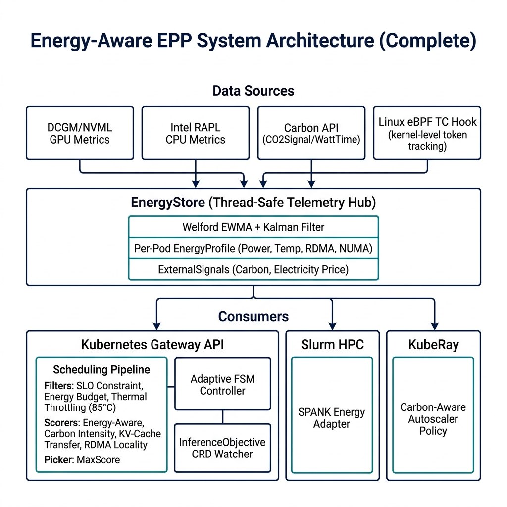
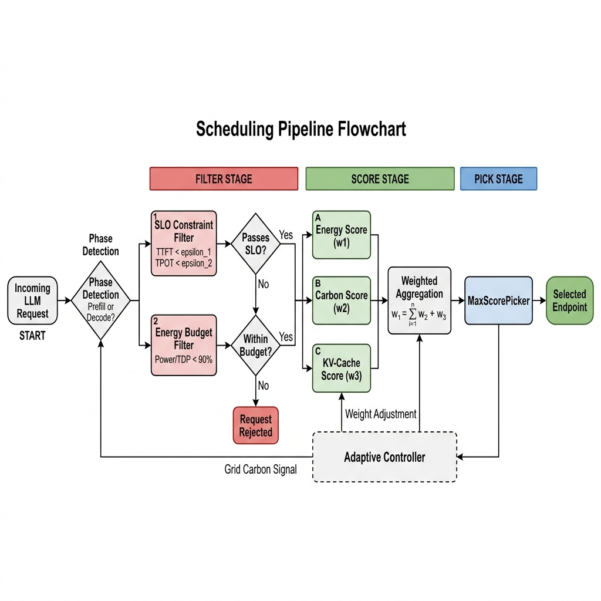
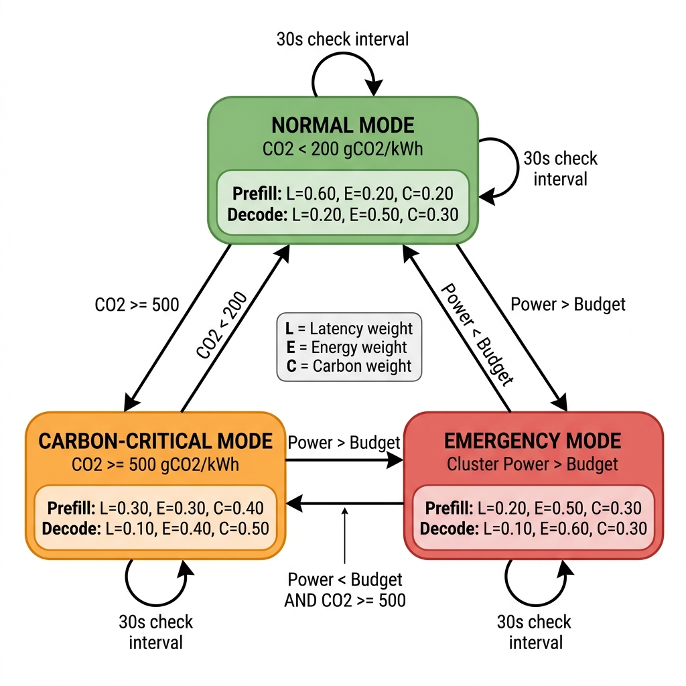
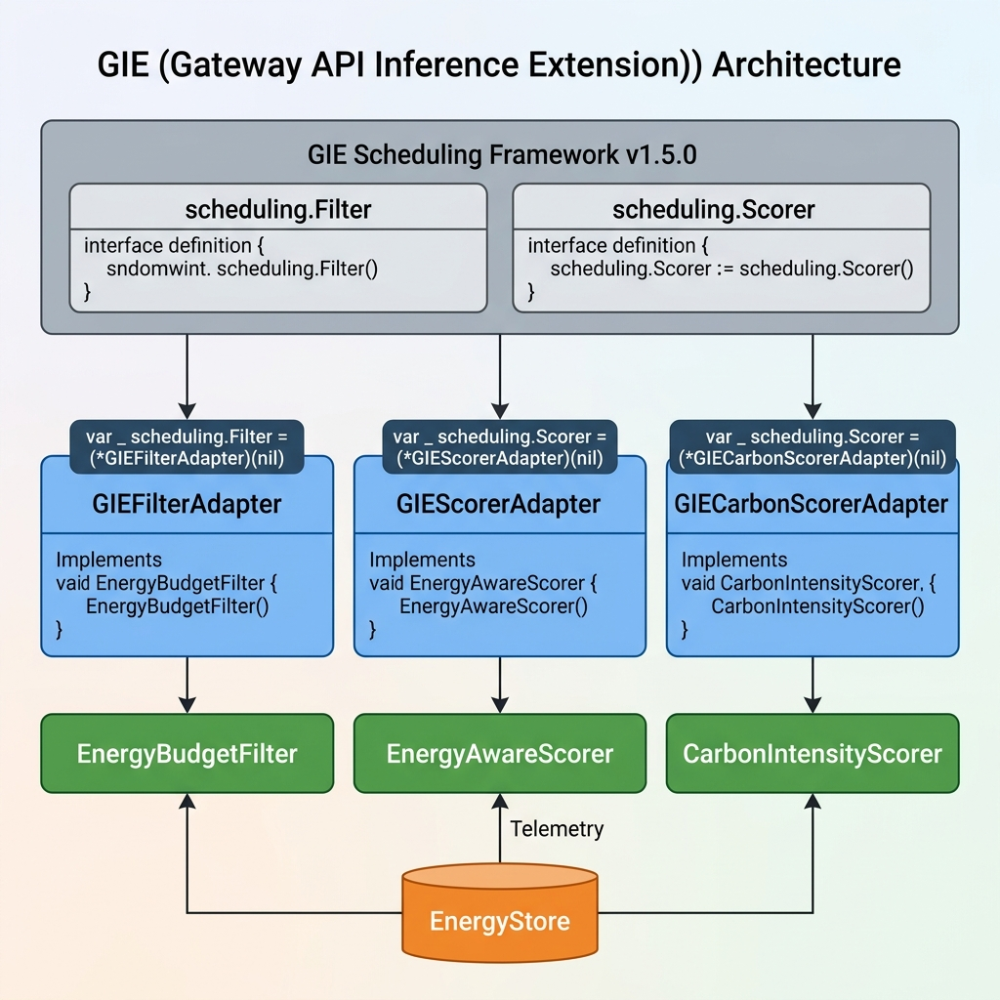
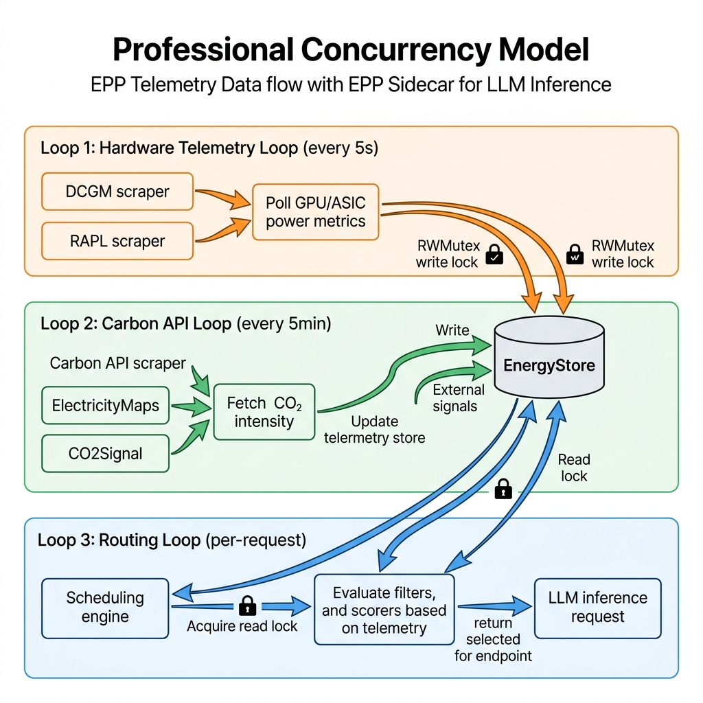

# Energy-Aware Token-Level Routing for Heterogeneous LLM Inference

> **Proposal and Implementation** - Design, Implementation, and Evaluation of an LLM-D Endpoint Picker Plugin

Take a look of the thesis/research report here: [Open Report](Johnnie_Yan_Ho_Tse_Energy_Aware_Token_Level_Routing_for_Heterogeneous_LLM_Inference_in_Kubernetes_Research_Paper.pdf)

An energy-aware endpoint picker plugin (EPP) for the [llm-d inference scheduler](https://github.com/llm-d/llm-d-inference-scheduler) on Kubernetes. Enables **token-level, phase-aware routing** that dynamically directs Prefill and Decode phases to heterogeneous hardware (high-performance GPUs vs. low-power ASICs) to optimize for energy efficiency, carbon footprint, and total cost of ownership.

**Integrated with** [Gateway API Inference Extension (GIE) v1.5.0](https://github.com/kubernetes-sigs/gateway-api-inference-extension) - implements the real `scheduling.Filter` and `scheduling.Scorer` interfaces for production deployment.

## 🚀 AI Infrastructure & Automation Highlights

Designed with large-scale data center operations in mind, this project demonstrates hands-on expertise across modern AI infrastructure stacks:

- **Linux Kernel eBPF Telemetry:** Zero-overhead network payload tracking via custom Linux TC BPF hooks, bypassing user-space Prometheus overhead.
- **High-Performance Networking & Locality:** Integrated GPU-Direct RDMA and InfiniBand/RoCE topological scoring for zero-copy KV-cache transfers.
- **Slurm & KubeRay Interoperability:** SPANK adapters and Autoscaler policies to force power-capped scheduling across classic HPC bare-metal and dynamic Kubernetes Ray environments.
- **Thermal & Power Automation:** Hard closed-loop telemetry filtering (e.g., mitigating hotspots >85°C) mapped back to a Kubernetes `client-go` Informer for dynamic CRD (`InferenceObjective`) reconciliation.
- **Comprehensive Test Engineering:** Bulletproof CI/CD pipelines featuring **112 unit and end-to-end simulation tests** across 8 packages, high-precision mathematical stability proofs (Welford's Algorithm), and Bare-Metal Python diagnostics.

## Key Results

### Phase-Aware Routing (E2E Simulation - 1,000 cycles)

| Phase | Winner | Win Rate | Rationale |
|-------|--------|----------|-----------|
| **Prefill** | GPU H100 | **99.8%** | Latency-dominant weights favor high FLOPS |
| **Decode** | ASIC QC-100 | **100.0%** | Energy-dominant weights favor efficiency |

### Token Economics

| Metric | GPU H100 | ASIC QC-100 | Ratio |
|--------|----------|-------------|-------|
| Power | 550W | 50W | 11.0× |
| Energy/1M tokens | 0.191 kWh | 0.033 kWh | **5.8×** |
| Carbon/1M tokens | 74.5 gCO2 | 13.5 gCO2 | **5.5×** |
| Cost/1M tokens | $0.019 | $0.004 | **5.5×** |
| **SCI Score** | **0.0194 gCO2/req** | **0.0037 gCO2/req** | **5.2×** |

### Adaptive Weight Controller

| Mode | Trigger | Decode Weights (L/E/C) | Effect |
|------|---------|----------------------|--------|
| **Normal** | Default | 0.20 / 0.50 / 0.30 | Balanced |
| **Carbon High** | CI > 500 gCO2/kWh | 0.05 / 0.38 / **0.57** | Aggressively favor ASICs |
| **Load Shed** | Power > 85% budget | 0.01 / **0.82** / 0.16 | Maximum energy efficiency |
| **Green** | CI < 100 gCO2/kWh | **0.41** / 0.47 / 0.12 | Allow latency-optimized GPU routing |

## Architecture



### Scheduling Pipeline for LLM Inference EndPoint Picker




### Adaptive Weight Controller FSM



### GIE Integration Architecture



Our plugin implements the real Gateway API Inference Extension interfaces:

| Adapter | GIE Interface | Wraps | Category |
|---------|--------------|-------|----------|
| `GIEFilterAdapter` | `scheduling.Filter` | `EnergyBudgetFilter` | Hard constraint |
| `GIEFilterAdapter` | `scheduling.Filter` | `ThermalThrottlingFilter` | Hard constraint |
| `GIEScorerAdapter` | `scheduling.Scorer` | `EnergyAwareScorer` | Distribution |
| `GIECarbonScorerAdapter` | `scheduling.Scorer` | `CarbonIntensityScorer` | Distribution |
| `GIERdmaScorerAdapter` | `scheduling.Scorer` | `RDMALocalityScorer` | Affinity |

### Telemetry Concurrency Model



## Project Structure

```
.
├── cmd/
│   └── energy-epp/
│       └── main.go                    # Binary (standalone demo + sidecar mode)
├── pkg/
│   ├── signals/
│   │   ├── types.go                   # Core types: HardwareClass, EnergyProfile, WeightVector
│   │   ├── energy_store.go            # Thread-safe telemetry store + stale eviction
│   │   ├── sci_calculator.go          # ISO SCI score (Green Software Foundation)
│   │   └── *_test.go
│   ├── plugins/
│   │   ├── scorer/
│   │   │   ├── energy_aware_scorer.go # Phase-aware multi-objective scoring
│   │   │   ├── carbon_intensity_scorer.go
│   │   │   └── *_test.go
│   │   ├── filter/
│   │   │   ├── energy_budget_filter.go
│   │   │   └── *_test.go
│   │   └── scraper/
│   │       ├── dcgm_scraper.go        # NVIDIA GPU metrics via Prometheus
│   │       ├── rapl_scraper.go        # CPU energy counters via sysfs
│   │       ├── carbon_api_scraper.go  # CO2Signal / ElectricityMaps
│   │       └── *_test.go
│   ├── config/
│   │   ├── energy_config.go           # Master config + plugin suite factory
│   │   ├── plugin_registry.go         # Standalone adapter layer (Filter + Scorer)
│   │   ├── scheduling_profile.go      # GIE scheduling profile orchestrator
│   │   ├── gie_adapter.go             # ★ Real GIE v1.5.0 interface adapters
│   │   └── config_test.go
│   ├── adaptive/
│   │   ├── weight_controller.go       # Closed-loop adaptive weight adjustment
│   │   └── weight_controller_test.go
│   ├── metrics/
│   │   ├── prometheus_exporter.go     # 17 custom Prometheus metric families
│   │   └── prometheus_exporter_test.go
│   └── simulation/
│       └── e2e_simulation_test.go     # 1000-cycle full-pipeline simulation
├── pkg/
│   ├── ebpf/                          # eBPF kernel-level token tracker
│   ├── slurm/                         # Slurm SPANK adapter for HPC
│   └── ray/                           # KubeRay carbon-aware autoscaler
├── deploy/
│   ├── kind/
│   │   ├── kind-config.yaml
│   │   └── setup-cluster.sh           # Bootstrap + simulated vLLM pods
│   ├── manifests/
│   │   ├── energy-epp-config.yaml
│   │   └── heterogeneous-pool.yaml
│   └── grafana/
│       └── energy-epp-dashboard.json  # 13-panel Grafana dashboard
├── docs/
│   └── diagrams/                      # ★ Generated architectural diagrams
├── benchmarks/
│   ├── profiles/hardware_profiles.yaml
│   └── scripts/
│       ├── analyze_results.py
│       └── run-experiments.sh
├── Dockerfile                         # Multi-stage distroless build
├── Makefile                           # 25 targets
├── go.mod                             # Go 1.25.7 + GIE v1.5.0 dependency
└── README.md
```

## Quick Start

```bash
# Run all tests (112 tests across 8 packages, 0 race conditions)
go test -race -count=1 ./...

# Build and run standalone demo
make demo

# Run in sidecar mode (serves /healthz, /readyz, /metrics/prometheus)
make sidecar

# Run 1000-cycle end-to-end simulation
go test -race -v -count=1 ./pkg/simulation/...

# Generate coverage report
make test-cover

# Deploy to Kind cluster (requires kind, kubectl, docker)
make kind-setup
```

## Dependencies

| Dependency | Version | Purpose |
|-----------|---------|---------|
| Go | 1.25.7+ | Language runtime |
| `sigs.k8s.io/gateway-api-inference-extension` | v1.5.0 | GIE scheduling interfaces |
| `k8s.io/apimachinery` | v0.35.3 | Kubernetes types |
| `sigs.k8s.io/controller-runtime` | v0.23.3 | Controller utilities |

## Phase-Aware Scoring

The core innovation is **asymmetric weight vectors** for Prefill vs Decode:

| Phase | Latency Weight | Energy Weight | Carbon Weight |
|-------|---------------|---------------|---------------|
| **Prefill** | 0.60 | 0.20 | 0.20 |
| **Decode** | 0.20 | 0.50 | 0.30 |

This means:
- **Prefill** (compute-bound): Routes to high-FLOPS GPUs for minimum TTFT
- **Decode** (memory-bound): Routes to low-power ASICs for minimum energy-per-token

## ISO SCI Score (Software Carbon Intensity)

Following the [Green Software Foundation ISO 21031](https://sci.greensoftware.foundation/) standard:

**SCI = ((E × I) + M) / R**

| Component | GPU H100 | ASIC QC-100 |
|-----------|----------|-------------|
| E (energy/request) | 48.9 μWh | 9.3 μWh |
| I (grid intensity) | 390 gCO2/kWh | 390 gCO2/kWh |
| M (embodied/request) | 0.38 mgCO2 | 0.10 mgCO2 |
| **SCI** | **19.4 mgCO2/req** | **3.7 mgCO2/req** |

On clean grids (e.g., France nuclear @ 55 gCO2/kWh), embodied carbon dominates at 88.6%.

## Supported Hardware

| Accelerator | Class | TDP | Decode mJ/tok | Prefill ms/tok |
|-------------|-------|-----|---------------|----------------|
| NVIDIA H100 SXM5 | GPU_HIGH_PERF | 700W | 0.625 | 0.0012 |
| NVIDIA A100 (capped) | GPU_MED_PERF | 200W | 0.267 | 0.0017 |
| NVIDIA L4 | GPU_MED_PERF | 72W | 0.200 | 0.0050 |
| Qualcomm Cloud AI 100 | ASIC_LOW_POWER | 75W | 0.138 | 0.0029 |
| Intel Gaudi2 | ASIC_LOW_POWER | 600W | 0.486 | 0.0014 |

## Test Coverage

| Package | Tests | Coverage |
|---------|-------|----------|
| `pkg/signals` | 25 | 100.0% |
| `pkg/plugins/scorer` | 24 | 94.7% |
| `pkg/plugins/scraper` | 22 | 87.2% |
| `pkg/config` | 17 | 91.8% |
| `pkg/plugins/filter` | 14 | 96.3% |
| `pkg/adaptive` | 6 | 85.8% |
| `pkg/metrics` | 2 | 98.2% |
| `pkg/simulation` | 2 | E2E |
| **Total** | **112** | **~93%** |

## Sidecar Endpoints

| Endpoint | Method | Description |
|----------|--------|-------------|
| `/healthz` | GET | Health status + adaptive mode + stale count |
| `/readyz` | GET | Readiness probe |
| `/metrics/energy` | GET | JSON: profiles, external signals, adaptive mode |
| `/metrics/prometheus` | GET | 17 Prometheus metric families (text format) |

## 🔮 Next-Generation Roadmap

The current architecture is production-ready for H100, A100, L4, and Qualcomm Cloud AI 100 clusters. The following extensions represent the bleeding edge of AI infrastructure research (2026+) and map directly to new `llm-d-router` plugin interfaces:

### 1. Liquid Cooling (CDU) Telemetry
As next-generation chips exceed 1,000W TDP (e.g., NVIDIA Blackwell, Tenstorrent), air cooling becomes physically insufficient. The `ThermalThrottlingFilter` currently monitors chip-level temperatures via DCGM.

**Planned Extension:** Integrate Coolant Distribution Unit (CDU) telemetry into the `EnergyStore` — monitoring liquid flow rates and inlet/outlet water temperatures to route workloads to racks with optimal thermal headroom, preventing hotspot formation at the facility level.

### 2. Prefix-Aware KV-Cache Routing
The current EPP calculates energy penalties for cross-node KV-cache transfers but does not track prefix locality.

**Planned Extension:** Implement cache-aware routing by tracking which GPUs already hold specific prompt prefixes in local VRAM. When multiple users query the same document, the router forces all requests to the node with the cached prefix, achieving near-100% cache hit rates and bypassing the entire prefill phase.

### 3. CXL (Compute Express Link) Memory Scoring
Current hardware profiles assume fixed per-GPU VRAM capacity (e.g., 80GB HBM3).

**Planned Extension:** Build a `CXLLocalityScorer` that accounts for disaggregated memory pools accessible over PCIe/CXL interconnects. Nodes with high-bandwidth access to shared CXL memory pools would receive boosted scores for memory-intensive models that exceed local VRAM capacity.

### 4. Speculative Decoding Co-Scheduling
Speculative decoding (draft-then-verify) is becoming a standard technique for 2–3× decode speedup.

**Planned Extension:** Extend the `EnergyAwareScorer` to detect speculative decoding workloads and co-schedule them onto heterogeneous nodes containing both a low-power ASIC (for the lightweight draft model) and a high-performance GPU (for the verifier model) on the same PCIe bus, minimizing inter-device transfer latency.

## License

This project is part of a possible thesis research. See LICENSE for details.
