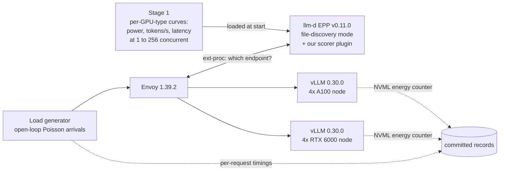

# Energy-Aware Routing for Heterogeneous LLM Inference

A measured study, and an out-of-tree plugin for the
[llm-d router](https://github.com/llm-d/llm-d-router), asking one question:
**can an inference router save energy by choosing which GPU serves each
request, without slowing requests past their latency target, when the tenant
has no privileged control over the hardware?**

> **Status, 2026-10-09: research in progress.** Every number on this page was
> measured on real GPUs, and each one is traced to a job id and a committed
> raw record. The figures this README used to show came from a 1,000-cycle
> simulation and are **withdrawn**; see [What was withdrawn](#what-was-withdrawn).
> The authoritative record is [`docs/plan/FINAL-PLAN-2026-10.md`](docs/plan/FINAL-PLAN-2026-10.md).
>
> **Correction, 2026-10-09.** An audit found that an earlier claim on this
> page, that fleet composition decides whether energy-aware routing helps, was
> not supported. Finding 2 below says what the records actually show. The
> comparative study is being re-designed before any of its trials run.

The May 2026 thesis document is a **proposal written before any
measurement**. It is kept in
[`legacy/thesis-proposal-2026-05/`](legacy/thesis-proposal-2026-05/) with a
note on which of its parts are not measurements (all of its chapter 5).

## What has been measured

Testbed: Queen's University **Frontenac** HPC cluster (Slurm, no Kubernetes, no
root access). GPUs: NVIDIA A100-PCIE-40GB and Quadro RTX 6000. Model:
Qwen2.5-1.5B-Instruct. Server: vLLM 0.30.0, the official container. Energy:
NVML's hardware energy counter, read per GPU, per node. Requests: open-loop
arrivals at fixed rates, with a 2.0 s end-to-end latency target (the SLO).

The metric is **SLO-goodput per joule**: requests that met the latency
target, per joule of GPU energy. Each policy is compared at its own best load
level among those where at least 95% of requests meet the target, so a
policy cannot win by saving energy on requests that missed it.

### 1. On a mixed fleet, energy-aware placement wins narrowly but consistently

4x A100 + 4x RTX 6000, three trials at seeds 7, 11 and 13 (jobs 12305232,
12319685, 12321476). All 75 measurement cells are valid.

| Policy | SLO-goodput per joule | vs `slo_packing` | Per trial |
|---|---|---|---|
| `energy_consolidate` | 0.3574 | **+1.4%** | +2.0%, +1.2%, +1.0% |
| `energy_greedy` | 0.3559 | +0.9% | +1.6%, +0.8%, +0.5% |
| `slo_packing` (baseline) | 0.3526 | | |
| `least_loaded` | 0.2323 | -34.1% | |
| `round_robin` | 0.1096 | -68.9% | |

The pre-registered gate passes: `energy_consolidate` beats the baseline in
every trial. The margin is small. Three positive trials out of three is weak
evidence on its own (a coin would do it one time in eight), so the trial
count for the comparative study is set by a power analysis before any further
claim is made.

There is a caveat on what regime this was. On this fleet the packing
policies were stopped by the **edge of the measured A100 curve**, which ends
at 128 concurrent requests. Above that the router treats an A100 as full, and
A100 latency there is only 0.9 s against the 2.0 s target. The +1.4% is
therefore a margin under an undeclared per-GPU cap. Its size with the cap
removed is not yet known (finding 2).

### 2. On a single-type fleet, packing to the latency target fails, for every packing policy

8x RTX 6000, load inside that fleet's capacity (job 12321478). The three
policies that pack load (`slo_packing`, `energy_greedy`, `energy_consolidate`)
met the 2.0 s target for only 30 to 83% of requests. `round_robin` met it for
100%, up to 250 req/s.

What the records show is a **packing aim**, not an energy effect:

- The packers add work to a GPU until its *predicted* latency equals the
  target. The prediction is accurate (within 0.02 s of measured latency up to
  96 concurrent requests), so they run right on the line: median
  latency 1.98 to 2.01 s. About half the requests land just over it.
- `slo_packing`, which never looks at energy, fails worst: 63% at only
  12.5 req/s per GPU.
- The RTX 6000 curve reaches 256 concurrent requests, so on this fleet the
  target is what stops packing. On the mixed fleet the A100 curve's edge
  stopped it first. The two fleets were limited by **different things**, so
  comparing them does not isolate fleet composition.

An earlier version of this page read the contrast as "the fleet's
composition decides whether energy-aware routing helps". The records do not
support that. The fix is a declared **headroom**: packers aim at
(1 - h) x 2.0 s, with h chosen by a calibration rule committed before its
data existed. Both GPU types are also being re-measured to 256 concurrent
requests, so that the target binds on both fleets. See plan section 12.14d.

### 3. The router path costs about one millisecond

Job 12321497, using vLLM's own benchmark client. Measured, not estimated:

| Cost | Measured |
|---|---|
| Router path (Envoy, then the EPP), median time to first token | +1.2 to +2.4 ms |
| Router path, median end-to-end | +0.06% to +0.28% |
| The EPP's routing decision | about 0.2 ms |
| The EPP polling each vLLM's metrics every 50 ms, median time to first token | under +1 ms |

There is no Prometheus server in this system. The EPP reads each vLLM
server's metrics page directly, off the request path, and that can be turned
off entirely.

### 4. The load generator is accurate per token

A Python generator's inter-token timings agree with vLLM's own histogram:
across 50 cells (jobs 12319685 and 12321476), the median gap is **0.6-0.9%**
and the worst is **2.3%**, about 0.15 ms on a 7 ms gap. The generator reads
slightly high, by about 0.8% on average, most at the highest load. The two
come from independent sources. See
[`docs/figures/measured/`](docs/figures/measured/).

## The llm-d router runs here without Kubernetes

llm-d is Kubernetes-native, but its endpoint picker (EPP) has a documented
**file-discovery mode** that needs no Kubernetes: a static list of vLLM
servers, Envoy in front, and the EPP between them. Smoke tests 12321494 and
12321496 routed **40 of 40** requests through Envoy, then the EPP with our
plugin, then two vLLM servers, on a Slurm node. Which features need
Kubernetes, and why the scorer does not, is set out in plan section 12.14a.

```mermaid
flowchart LR
  C1["Stage 1<br/>per-GPU-type curves:<br/>power, tokens/s, latency<br/>at 1 to 256 concurrent"] -->|loaded at start| P
  G["Load generator<br/>open-loop Poisson arrivals"] --> E["Envoy 1.39.2"]
  E <-->|"ext-proc: which endpoint?"| P["llm-d EPP v0.11.0<br/>file-discovery mode<br/>+ our scorer plugin"]
  E --> A["vLLM 0.30.0<br/>4x A100 node"]
  E --> R["vLLM 0.30.0<br/>4x RTX 6000 node"]
  A -. NVML energy counter .-> M[("committed records")]
  R -. NVML energy counter .-> M
  G -. per-request timings .-> M
```

Design diagrams of the current system, how a packing policy decides, why the
latency model changed, and a timeline of every checkpoint are in
[`docs/diagrams/current/`](docs/diagrams/current/). Superseded data is kept
and indexed in [`docs/plan/CHECKPOINT-2026-10-09.md`](docs/plan/CHECKPOINT-2026-10-09.md).

This is the Stage 5 path. In Stage 2 the routing rule lived inside the load
generator, which sent each request straight to the chosen vLLM server; Envoy
and the EPP were not involved. Stage 4 moves the rule into the EPP, so the
router itself makes every decision.

Everything is pinned to one release: **llm-d-router v0.11.0** (commit
`a5cbe600`), **Envoy 1.39.2**, **vLLM 0.30.0**. The EPP binary is built
reproducibly by [`router-plugin/build.sh`](router-plugin/build.sh).

## What is not done yet

- **The energy-aware scorer is not in the router yet.** `router-plugin/`
  currently ships an inert probe that proves the wiring. All results above
  come from routing rules written in the Python load generator, so they show
  that the **rule** works, not yet that an llm-d plugin delivers it. Porting
  the winning rule to Go is Stage 4. It will use the EPP's own count of
  in-flight requests, which needs no metrics polling.
- **The pre-registration is being amended before any of its trials run.**
  [`PREREGISTRATION-STAGE5.md`](docs/plan/PREREGISTRATION-STAGE5.md) was frozen
  as tag `prereg-stage5-v1` on 2026-10-09. The same day's audit showed it
  inherited the unequal limits in finding 2. The amendment adds three things:
  a calibrated packing headroom, curves matched to 256 on both GPU types, and
  llm-d's own SLO-packing scorer (`latency-scorer`) as a baseline. It is tagged
  `prereg-stage5-v2`. The v1 tag stays where it is.
- `energy_consolidate` against `energy_greedy` (+0.4 to +0.5 points per
  trial) is not a resolved difference. It is registered as its own
  hypothesis.

## How this relates to prior work

Placing requests on more energy-efficient hardware is **not a new idea**.
Wilkins, Keshav and Mortier proposed it in 2024 (arXiv 2407.00010 and
2407.04014, HotCarbon 2024), evaluated on a workload trace with offline energy
models. Work as of 2026-10-09, re-checked against the records:

| Work | Picks among replicas of one model? | Energy objective? | Needs privileged GPU control? |
|---|---|---|---|
| Solyx AI Grid (arXiv 2606.15050), Lodestar (2606.00946) | yes | **no** (throughput, latency) | no |
| VoltanaLLM (2509.04827), DualScale (2602.18755) | yes | yes | **yes**, GPU frequency |
| Festina (2606.30391), EnerTune (SOSP '26) | placement or co-location | yes | **yes**, MPS, frequency or sharing |
| TAPAS (ASPLOS '25) | across VMs | power and thermal limits | provider-level |
| llm-d's own scorers, v0.11.0 | yes | **no** | no |

What this project adds is narrower: a **measured, online** test of
energy-objective replica selection inside a production router's plugin API,
at a fixed latency target, by an **unprivileged** tenant, with clocks
untouched. VoltanaLLM routes for energy but reports no routing-only result
with frequency fixed. Festina's cumulative ablation credits SLO-aware
placement with about 2%, but only on top of its frequency and MPS stages. So
routing's own share, isolated, is what remains unmeasured. All
of these were fetched from arXiv, Crossref or the paper on 2026-10-09; the
full positioning is in plan sections 12.2 and 12.14e.

## Repository layout

| Path | What it is |
|---|---|
| [`docs/plan/FINAL-PLAN-2026-10.md`](docs/plan/FINAL-PLAN-2026-10.md) | The authoritative plan, results, threats to validity and defect log |
| [`experiments/scripts/`](experiments/scripts/) | Measurement harness, Slurm jobs, the Stage 2 gate (`stage2_analyse.py`), the verification suite (`verify_fixes.sh`) |
| [`experiments/cluster-records/`](experiments/cluster-records/) | Every raw record fetched from the cluster, logs gzipped |
| [`docs/figures/measured/`](docs/figures/measured/) | Figures from those records, each with a CSV of the plotted numbers; regenerate with `python experiments/scripts/make_figures.py` |
| [`router-plugin/`](router-plugin/) | Out-of-tree llm-d-router plugin module and the EPP entry point |
| [`llm-d-ref/`](llm-d-ref/) | Git submodule of the official llm-d-router, pinned to v0.11.0 |
| [`tools/cluster-helpers/`](tools/cluster-helpers/) | Local scripts that connect to the cluster, submit, wait and fetch |
| `pkg/`, `cmd/energy-epp/` | Pre-measurement code. Builds and tests pass, but its scorer uses a GPU power-rating (TDP) proxy that the measurements refuted, and it does not plug into llm-d-router. Being rewritten in Stage 4 |
| [`docs/plan/PREREGISTRATION-STAGE5.md`](docs/plan/PREREGISTRATION-STAGE5.md) | The pre-registered comparative study, with its analysis (`prereg_analysis.py`) and sample size (`power_analysis.py`) |
| [`legacy/`](legacy/) | Quarantined components kept for history: the simulation, eBPF tracker, Slurm SPANK adapter, KubeRay policy, thermal filter, SCI calculator, KV-transfer and RDMA scorers, the old upstream port, and the May 2026 thesis proposal |

See [`QUICKSTART.md`](QUICKSTART.md) to rerun the analysis from the committed
records, build the EPP, or reproduce a measurement.

## What was withdrawn

Until 2026-10-08 this README presented results from a 1,000-cycle simulation
as findings: prefill and decode "win rates" between an H100 and a Qualcomm
Cloud AI 100, per-token energy, carbon and cost ratios, ISO SCI scores, and an
adaptive weight controller's modes. **None of that hardware was measured.** The
energy and power figures were modelled, not read from instruments. The
project's rule since 2026-10-03 is that simulated numbers are never presented
as results.

**The older figures are synthetic too.** `docs/figures/fig1` to `fig16` are
drawn from `legacy/benchmarks-pre-measurement/results/frontenac/heterogeneous_realistic/`, which is
written by `generate_realistic_telemetry.py`. By its own description, that
script produces "Production-Grade Synthetic Telemetry" with imperfections added
"to make the data credible". The `frontenac` in the path does not make it a
measurement. The data-style plots in `docs/diagrams/` come from values written
into their generators. Both folders now carry a README saying so; the figures
are kept because drafts refer to them. Measured replacements are in
[`docs/figures/measured/`](docs/figures/measured/). **Any thesis or paper
figure built from the old ones must be replaced or removed.** The May 2026
thesis proposal's chapter 5 draws on the same synthetic data; it is now in
[`legacy/thesis-proposal-2026-05/`](legacy/thesis-proposal-2026-05/).

The simulation and the components built around it are in [`legacy/`](legacy/).
The old README remains in git history: `git show 3543e10:README.md`.

## License

Apache License 2.0; see [LICENSE](LICENSE). Part of ongoing thesis research.
