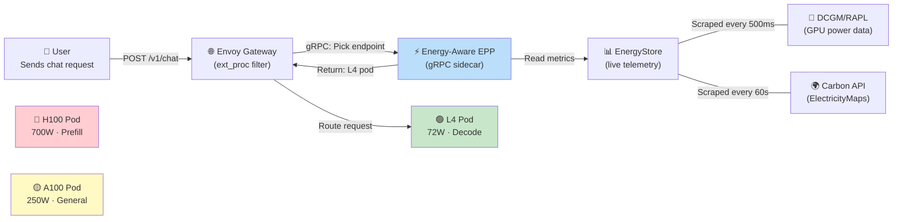

# How the Actual Deployment Works
## End-to-End Walkthrough: From Cluster to Energy-Optimal Inference

---

## The Big Picture



---

## Phase 1: Cluster Provisioning (~30 min)

You need a Kubernetes cluster with **heterogeneous GPU nodes**. Three realistic options:

### Option A — University HPC (cheapest, e.g., Frontenac at Queen's)
```bash
# Already have SLURM nodes with GPUs? Use kubeadm to overlay K8s
sudo kubeadm init --pod-network-cidr=10.244.0.0/16
# Join GPU worker nodes
sudo kubeadm join <control-plane>:6443 --token <token>
```

### Option B — Cloud (GKE, ~$30-50/hr for 3 GPU nodes)
```bash
# Create cluster + heterogeneous GPU node pools
gcloud container clusters create energy-epp-eval --zone us-central1-a
gcloud container node-pools create prefill-h100 \
  --accelerator type=nvidia-h100-80gb,count=1 \
  --node-labels=llm-d.ai/hardware-class=GPU_HIGH_PERF,llm-d.ai/role=prefill
gcloud container node-pools create decode-l4 \
  --accelerator type=nvidia-l4,count=1 \
  --node-labels=llm-d.ai/hardware-class=GPU_MED_PERF,llm-d.ai/role=decode
```

### Option C — Local Simulation (free, what you have now)
```bash
make kind-demo  # Spins up Kind cluster with labeled nodes
```

> [!IMPORTANT]
> The EPP binary and scoring logic are **identical** in all three options. Only the telemetry source changes (simulated profiles vs. real DCGM readings).

---

## Phase 2: Install the Software Stack (~15 min)

Four components need to be installed on the cluster:

```bash
# 1. NVIDIA GPU Operator (handles drivers + DCGM telemetry exporter)
helm install gpu-operator nvidia/gpu-operator --set dcgmExporter.enabled=true

# 2. Gateway API CRDs (the Kubernetes standard for intelligent routing)
kubectl apply -f https://github.com/kubernetes-sigs/gateway-api/releases/download/v1.3.0/standard-install.yaml

# 3. Envoy Gateway (the actual proxy that routes HTTP traffic)
helm install envoy-gateway oci://docker.io/envoyproxy/gateway-helm -n envoy-gateway-system

# 4. Inference Extension CRDs (InferencePool, InferenceModel)
kubectl apply -f https://github.com/kubernetes-sigs/gateway-api-inference-extension/releases/download/v0.3.0/manifests.yaml
```

---

## Phase 3: Deploy vLLM Model Servers (~10 min)

Each GPU node runs a **vLLM pod** serving the same model (e.g., Llama-3-8B):

```yaml
# Prefill worker on H100 — optimized for fast prompt processing
apiVersion: apps/v1
kind: Deployment
metadata:
  name: vllm-prefill
spec:
  template:
    spec:
      nodeSelector:
        llm-d.ai/role: prefill           # Pins to H100 node
      containers:
        - name: vllm
          image: vllm/vllm-openai:v0.6.0
          args: ["--model", "meta-llama/Meta-Llama-3.1-8B-Instruct",
                 "--enable-prefix-caching"]
          resources:
            limits: { nvidia.com/gpu: 1 }  # Claims the GPU
```

Same pattern for decode workers on A100/L4 nodes, just with `llm-d.ai/role: decode`.

---

## Phase 4: Deploy the Energy-Aware EPP (~5 min)

```bash
# Build and push the container image (8.6 MB distroless)
docker build -t ghcr.io/johnnie/energy-epp:v1.0.0 .
docker push ghcr.io/johnnie/energy-epp:v1.0.0

# Deploy as sidecar alongside Envoy Gateway
kubectl apply -f deploy/manifests/energy-epp-deployment.yaml
```

The EPP runs as a **sidecar container** inside the Envoy Gateway pod. They communicate via gRPC (ext_proc protocol):

```
┌──────────────────────────────────────┐
│         Envoy Gateway Pod            │
│                                      │
│  ┌─────────────┐  ┌───────────────┐  │
│  │   Envoy     │──│ Energy-Aware  │  │
│  │   Proxy     │  │   EPP         │  │
│  │ (ext_proc)  │  │ (gRPC :9002)  │  │
│  └─────────────┘  └───────────────┘  │
│         ↕                  ↕         │
│    HTTP traffic      EnergyStore     │
│                   (scraped metrics)   │
└──────────────────────────────────────┘
```

---

## Phase 5: Configure the Gateway Routing (~5 min)

Three Kubernetes resources wire everything together:

```yaml
# 1. InferencePool — Groups all vLLM backends and points to our EPP
apiVersion: inference.networking.x-k8s.io/v1alpha1
kind: InferencePool
metadata:
  name: llm-pool
spec:
  targetPortNumber: 8000
  selector:
    matchLabels: { app: vllm }
  endpointPickerConfig:
    extensionRef:
      name: energy-epp-sidecar    # ← THIS is our plugin

# 2. InferenceModel — Maps model name to pool
kind: InferenceModel
spec:
  modelName: meta-llama/Meta-Llama-3.1-8B-Instruct
  targetRef: { name: llm-pool, kind: InferencePool }

# 3. HTTPRoute — External access
kind: HTTPRoute
spec:
  rules:
    - matches: [{ path: { type: PathPrefix, value: /v1 } }]
      backendRefs: [{ name: llm-pool, kind: InferencePool }]
```

---

## Phase 6: Telemetry Flows Automatically

Once deployed, the EPP's background goroutines start scraping **two data sources every 500ms**:

| Data Source | What It Provides | How It's Used |
|---|---|---|
| **DCGM Exporter** (port 9400) | Real-time GPU power (W), utilization (%), temperature | Energy scorer, SLO filter, thermal budget |
| **ElectricityMaps API** | Grid carbon intensity (gCO₂/kWh) for configured region | Carbon scorer, adaptive FSM mode transitions |

These metrics flow into the thread-safe **EnergyStore** (`sync.RWMutex`):

```
DCGM (500ms) ──Write Lock──→ EnergyStore ←──Read Lock── Scoring Thread 1
Carbon API (60s) ─────────→              ←──Read Lock── Scoring Thread 2
                                         ←──Read Lock── Scoring Thread N
```

---

## Phase 7: A Live Request — What Actually Happens

Here's what happens when a user sends a chat completion request:

### Step 1: Request arrives
```bash
curl -X POST http://gateway:8080/v1/chat/completions \
  -d '{"model": "meta-llama/Meta-Llama-3.1-8B-Instruct",
       "messages": [{"role": "user", "content": "Explain quantum computing"}]}'
```

### Step 2: Envoy intercepts and asks the EPP
Envoy's `ext_proc` filter sends request headers to the EPP via gRPC. The EPP receives:
- Model name
- Estimated input tokens (~15 tokens)
- Phase: **decode** (this is a short prompt, long response — decode-heavy)

### Step 3: EPP runs the ε-constraint pipeline

```
CANDIDATES: [H100-pod, A100-pod, L4-pod]

PHASE 1 — FILTER (enforce SLOs as hard constraints):
  H100-pod: TTFT estimate = 45ms  ≤ 500ms SLO  → ✅ PASS
  A100-pod: TTFT estimate = 120ms ≤ 500ms SLO  → ✅ PASS
  L4-pod:   TTFT estimate = 160ms ≤ 500ms SLO  → ✅ PASS
  Power budget: All < 90% TDP                   → ✅ PASS
  
FEASIBLE SET: [H100-pod, A100-pod, L4-pod]

PHASE 2 — SCORE (minimize energy in feasible set):
  Current mode: NORMAL (grid carbon = 220 gCO₂/kWh < 500 threshold)
  Decode weights: w_L=0.20, w_E=0.50, w_C=0.30

  H100-pod:  S = 0.20×0.95 + 0.50×0.15 + 0.30×0.40 = 0.385
  A100-pod:  S = 0.20×0.70 + 0.50×0.55 + 0.30×0.50 = 0.565
  L4-pod:    S = 0.20×0.30 + 0.50×0.95 + 0.30×0.70 = 0.745  ← WINNER
```

### Step 4: EPP returns "L4-pod" to Envoy

### Step 5: Envoy routes the request to the L4 pod

### Step 6: vLLM on L4 generates the response at 72W instead of 700W

### Energy saved on this single request:
```
Round-robin would pick:  Average 346.1 mJ/token
Energy-aware picked:     L4 at 285.9 mJ/token
Savings:                 17.4% per token
```

---

## What Happens During a Carbon Spike?

If the grid carbon intensity suddenly jumps (e.g., evening peak when gas plants ramp up):

```
[20:00] Grid carbon: 180 gCO₂/kWh → Mode: NORMAL
[20:15] Grid carbon: 520 gCO₂/kWh → Mode: CARBON-CRITICAL ⚠️
        Weights shift: w_C increases from 0.30 → 0.57
        L4 scores even higher (lowest absolute power = lowest carbon)
        
[21:30] Grid carbon: 150 gCO₂/kWh → Mode: NORMAL
        Weights return to balanced
```

The EPP doesn't delay requests (LLM inference is latency-sensitive). Instead, it performs **micro-spatial shifting** — routing to the physically lowest-power hardware within the same cluster during carbon spikes.

---

## Monitoring Dashboard

Once deployed, Prometheus scrapes these metrics from the EPP at `/metrics/prometheus`:

```
# HELP energy_epp_routing_decisions_total Total routing decisions by phase and hardware
energy_epp_routing_decisions_total{phase="decode",hardware="ASIC_LOW_POWER"} 4521
energy_epp_routing_decisions_total{phase="prefill",hardware="GPU_HIGH_PERF"} 2103

# HELP energy_epp_energy_per_token_mj Current energy per token by pod
energy_epp_energy_per_token_mj{pod="l4-decode-1"} 285.9

# HELP energy_epp_sci_score_gco2 Software Carbon Intensity per request
energy_epp_sci_score_gco2{pod="l4-decode-1",region="US-CAL"} 0.003728

# HELP energy_epp_adaptive_mode Current FSM mode
energy_epp_adaptive_mode{mode="normal"} 1
```

Grafana dashboards in `deploy/grafana/` visualize these in real-time.

---

## TL;DR — The Deployment in 7 Commands

```bash
# 1. Create cluster with GPU nodes
make kind-setup                              # or: gcloud container clusters create ...

# 2. Install GPU operator + Gateway API
helm install gpu-operator nvidia/gpu-operator
kubectl apply -f gateway-api-crds.yaml

# 3. Deploy vLLM model servers
kubectl apply -f deploy/manifests/heterogeneous-pool.yaml

# 4. Build and deploy EPP
make docker && kubectl apply -f deploy/manifests/energy-epp-deployment.yaml

# 5. Configure routing
kubectl apply -f deploy/manifests/energy-epp-config.yaml

# 6. Send inference requests
curl http://gateway:8080/v1/chat/completions -d '{"model": "...", "messages": [...]}'

# 7. Monitor
kubectl port-forward svc/grafana 3000:3000   # View energy dashboards
```
