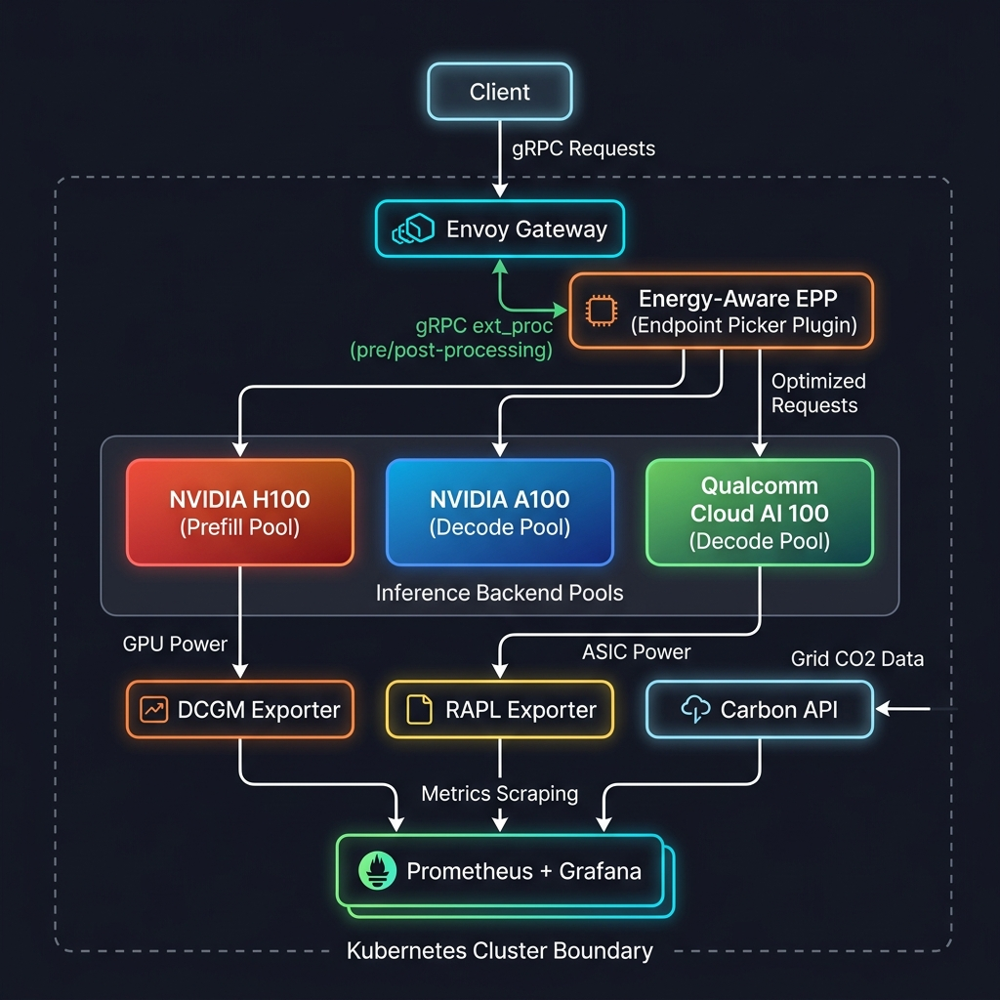
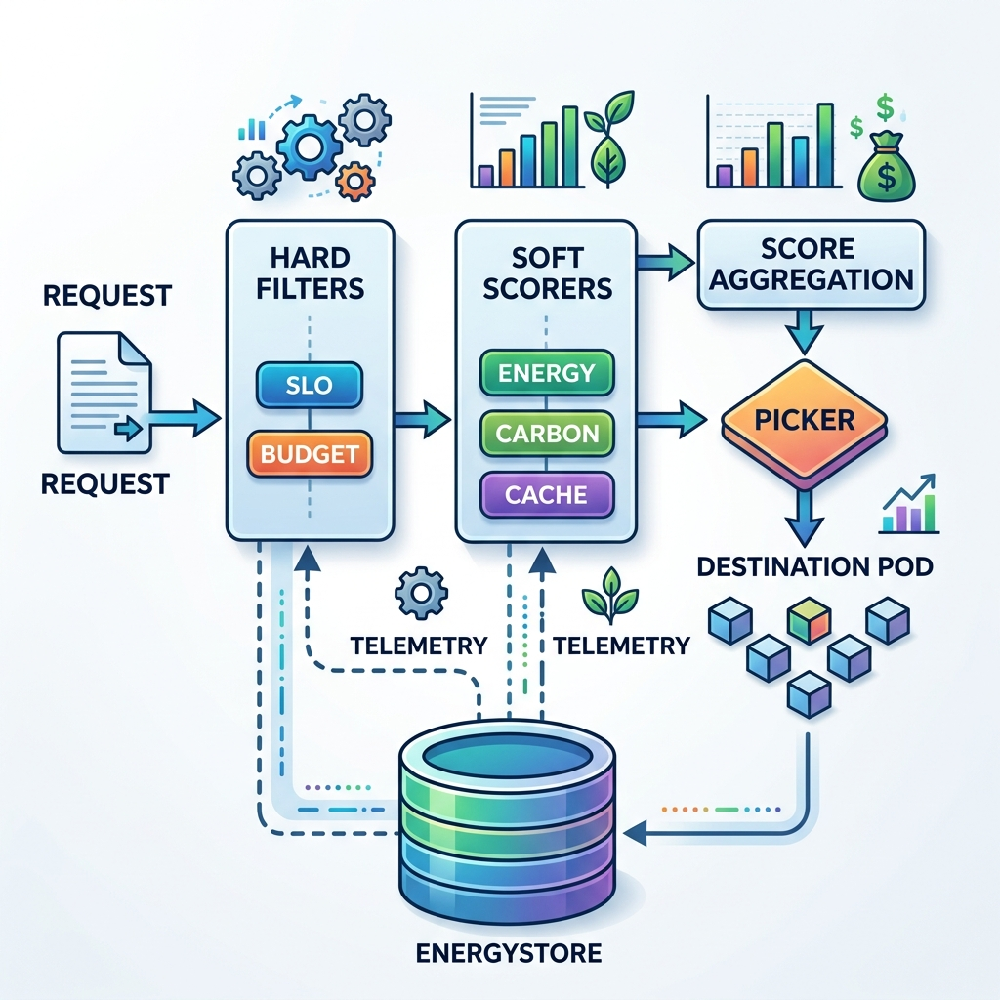
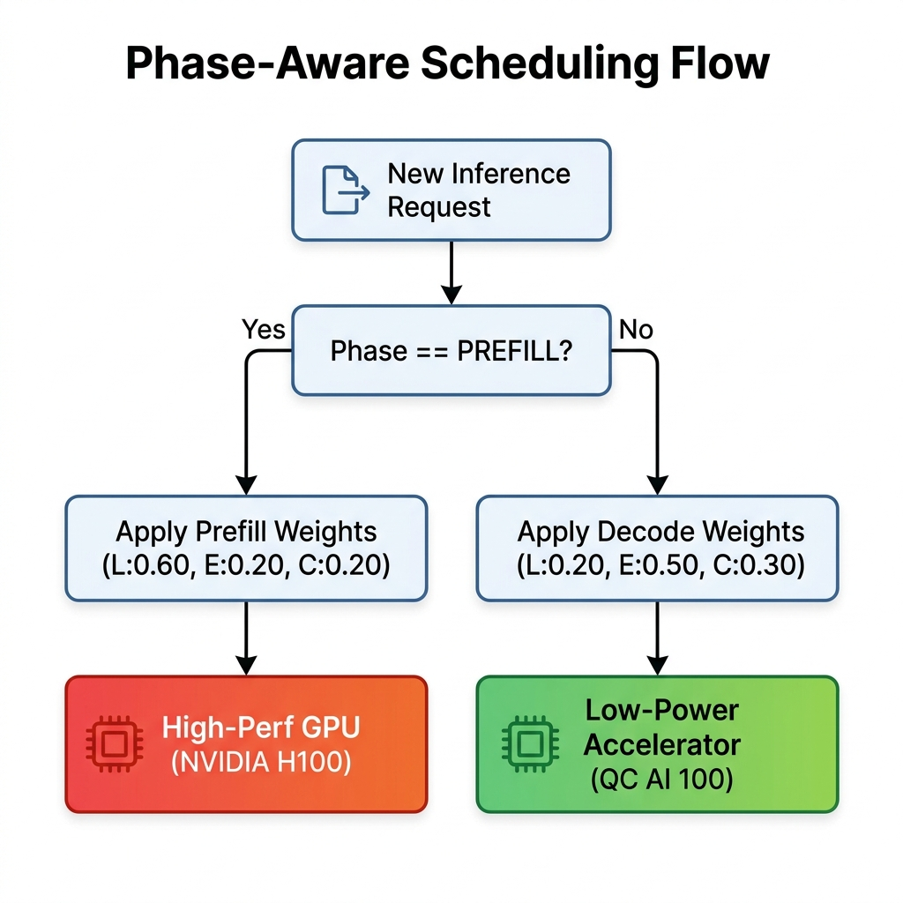
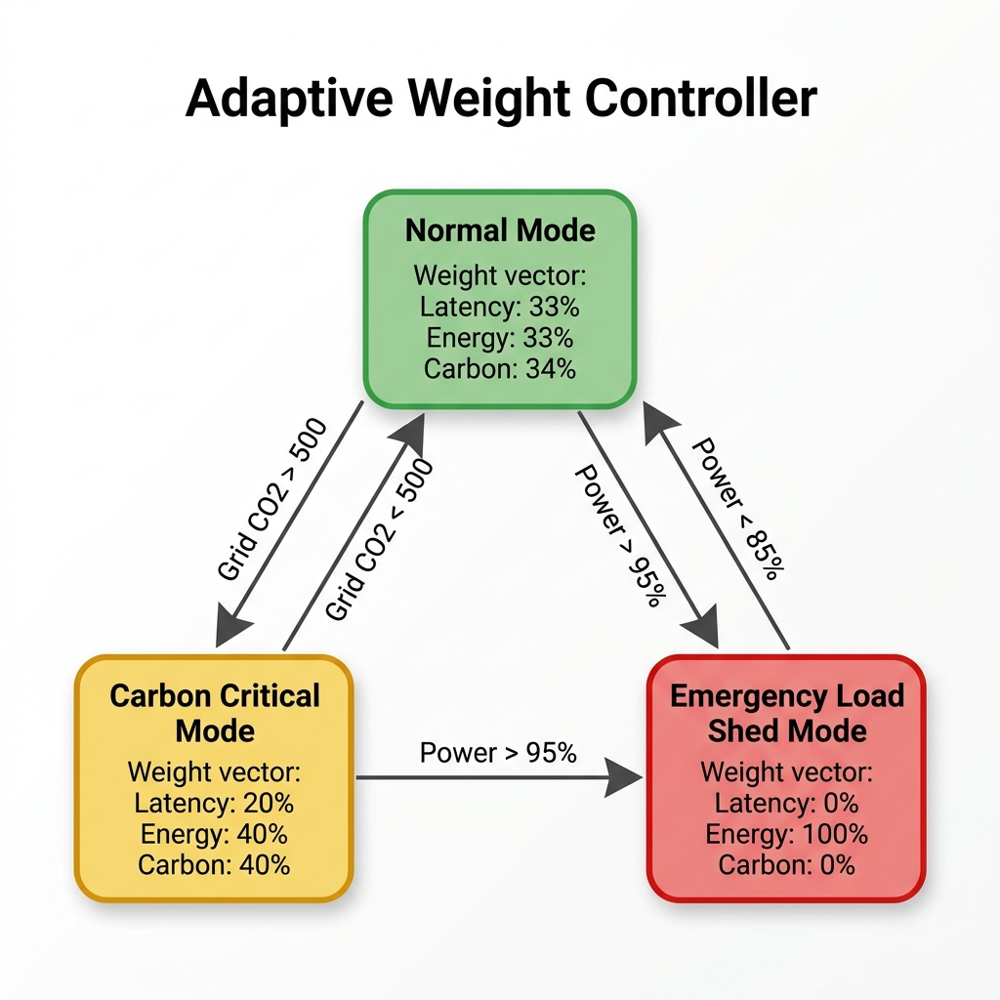
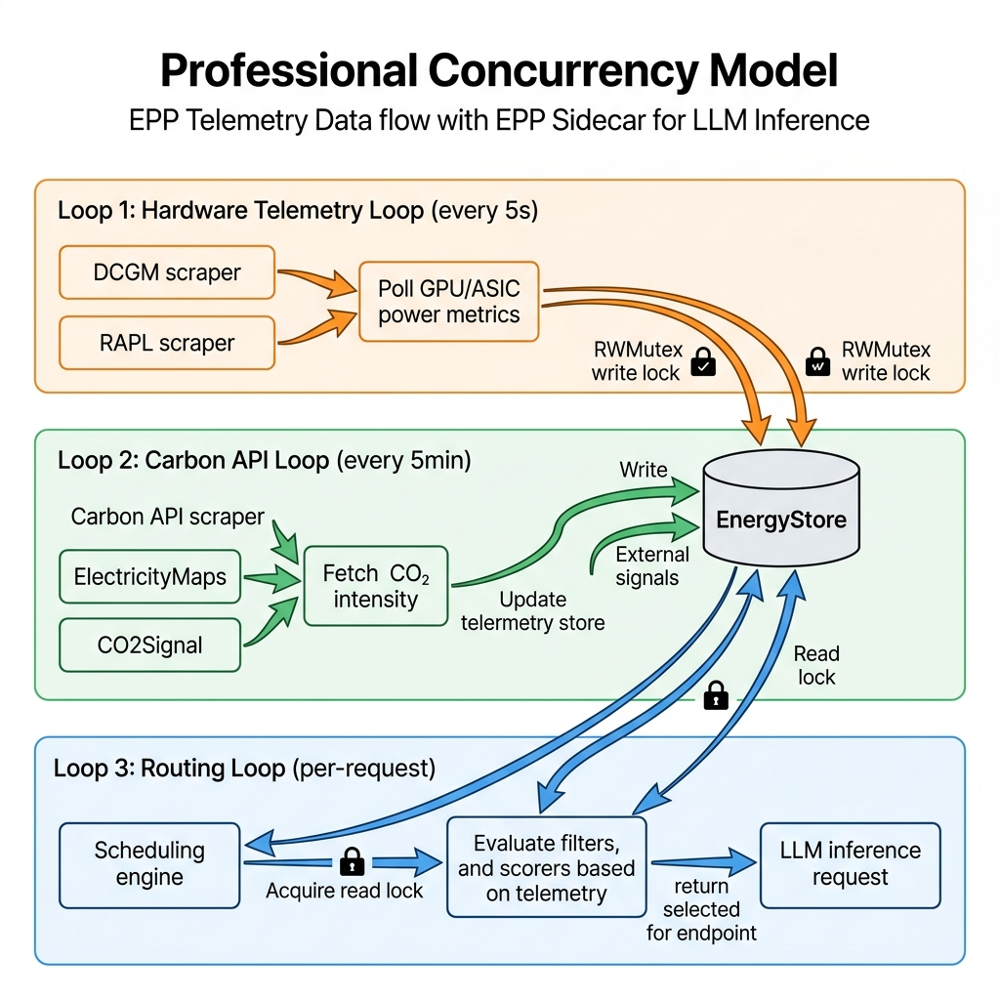
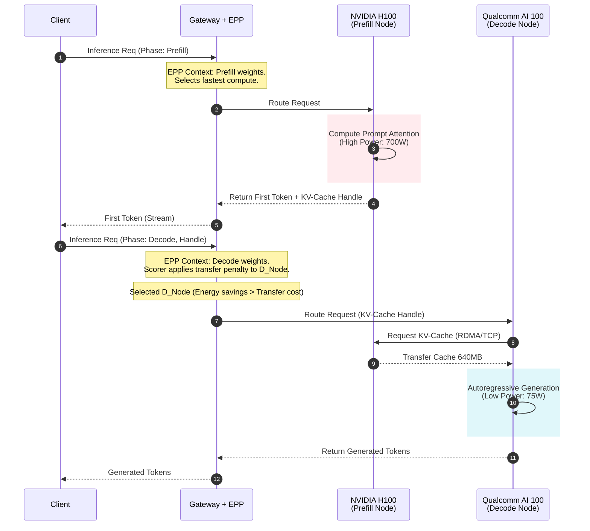

# Thesis Diagrams (Mermaid Format)

These diagrams are generated using [Mermaid.js](https://mermaid.js.org/). You can copy the code blocks directly into markdown editors that support Mermaid (like GitHub, GitLab, Obsidian) or use the [Mermaid Live Editor](https://mermaid.live/) to export them as high-resolution SVG/PNG files for inclusion in your LaTeX or Word thesis document.

---

## 1. High-Level System Architecture (Gateway API & llm-d)

**Caption**: *Figure 1: High-level architecture of the energy-aware LLM inference serving system. The system integrates via the Kubernetes Gateway API Inference Extension, using Envoy's `ext_proc` filter to offload routing decisions to the energy-aware Endpoint Picker Plugin (EPP) sidecar. The EPP continuously gathers telemetry from DCGM, RAPL, and Carbon APIs to make phase-aware routing decisions across heterogeneous hardware pools.*



---

## 2. EPP Internal Pipeline (Filter → Score → Pick)

**Caption**: *Figure 2: Internal scheduling pipeline of the Endpoint Picker Plugin. The process follows a strict Filter → Score → Pick hierarchy. Pods are first filtered based on hard latency constraints (ε-constraint method) and power budgets. The remaining feasible pods are then ranked using an aggregated multi-objective scoring function over energy, carbon, and KV-cache transfer metrics.*




---

## 3. Phase-Aware Scheduling Flow

**Caption**: *Figure 3: Phase-aware scheduling logic differentiating between prefill (compute-bound) and decode (memory-bound) requests. The dynamic weight vector $\vec{W} = \langle W_{Latency}, W_{Energy}, W_{Carbon} \rangle$ shifts based on the requested phase, prioritising latency for prefill and energy efficiency for decode.*



---

## 4. Adaptive Weight Controller State Machine

**Caption**: *Figure 4: Finite State Machine (FSM) representation of the Adaptive Weight Controller. Driven by a 30-second control loop, the system transitions between operational modes based on real-time grid carbon intensity ($I_{Grid}$) and cluster-wide power headroom.*



---

## 5. Telemetry Collection and Concurrency Model

**Caption**: *Figure 5: Data flow and concurrency architecture for energy telemetry aggregation. Asynchronous scrapers pull data from respective endpoints (DCGM, RAPL, CO2Signal) and update a thread-safe `EnergyStore`. Mutex locks (`RWMutex`) ensure zero data races between high-frequency background scrapers and latency-sensitive scheduling requests.*



---

## 6. SLO $\epsilon$-Constraint Filter Logic

**Caption**: *Figure 6: Flowchart of the $\epsilon$-Constraint SLO Filter. The algorithm evaluates each candidate pod against configured Time-To-First-Token (TTFT) and Time-Per-Output-Token (TPOT) bounds, ensuring latency-sensitive requests are not routed to slow or overloaded energy-efficient nodes.*

```mermaid
graph TD
    Start([Evaluate Pod P against Phase SLO]) --> Calc[Estimate Queue Delay<br/>Delay = QueueDepth * AvgReqTime]
    Calc --> IsPrefill{Request Phase}
    
    IsPrefill -- PREFILL --> EstPrefill[Estimate Prefill Latency<br/>Lat = (Tokens / Throughput_P) + Delay]
    EstPrefill --> CheckTTFT{Lat <= TTFT_SLO?}
    
    CheckTTFT -- Yes --> Accept([Accept Pod into Feasible Set])
    CheckTTFT -- No --> Reject([Reject Pod<br/>Violates TTFT])
    
    IsPrefill -- DECODE --> EstDecode[Estimate Decode Latency<br/>Lat = 1000 / Throughput_D]
    EstDecode --> CheckTPOT{Lat <= TPOT_SLO?}
    
    CheckTPOT -- Yes --> CheckQueue{Queue Depth < Max}
    CheckQueue -- Yes --> Accept
    CheckQueue -- No --> RejectQueue([Reject Pod<br/>Overloaded])
    
    CheckTPOT -- No --> RejectTPOT([Reject Pod<br/>Violates TPOT])

    classDef acc fill:#c8e6c9,stroke:#2e7d32
    classDef rej fill:#ffcdd2,stroke:#c62828
    
    class Accept acc
    class Reject,RejectTPOT,RejectQueue rej
```

---

## 7. Disaggregated Serving KV-Cache Transfer Flow

**Caption**: *Figure 7: Sequence diagram demonstrating disaggregated serving with KV-cache transfer. A prompt is first routed to a high-power GPU for compute-intensive prefill, the resulting KV-cache is transferred to an energy-efficient ASIC, which assumes the decode workload. The `KVCacheTransferScorer` calculates the energy penalty ($E_{transfer}$) for this operation.*



---

## Instructions for Use in Thesis
1. Open [Mermaid Live Editor](https://mermaid.live).
2. Paste the raw text within the ````mermaid ```` blocks.
3. Use the "Export" functionality to save as an SVG or PNG.
4. Insert into your Word or LaTeX document, using the provided Captions for proper academic formatting. 
