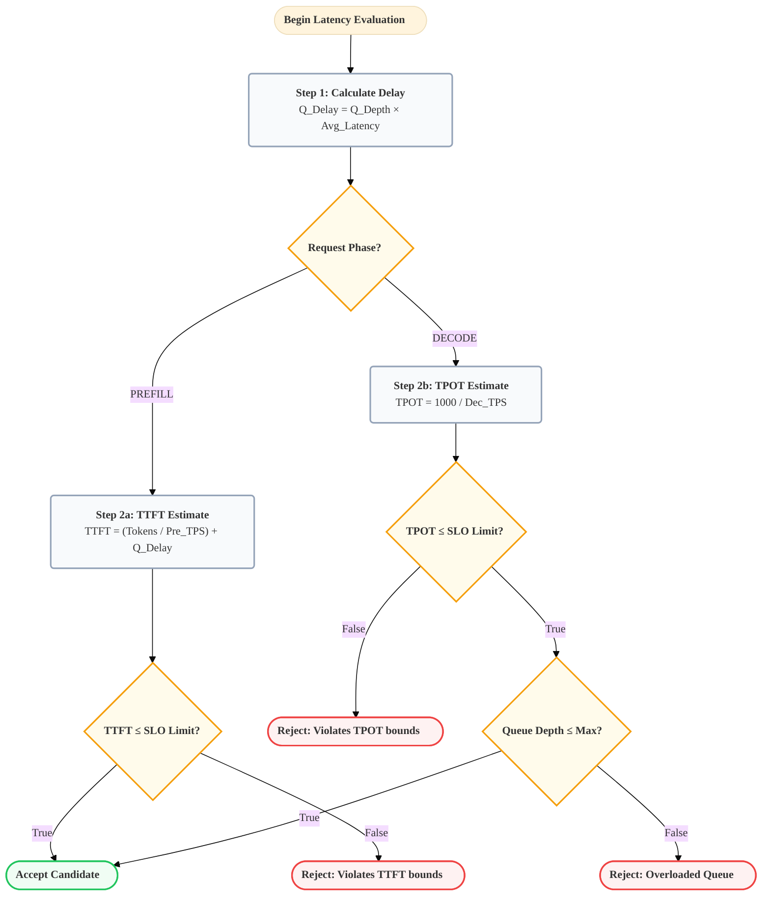
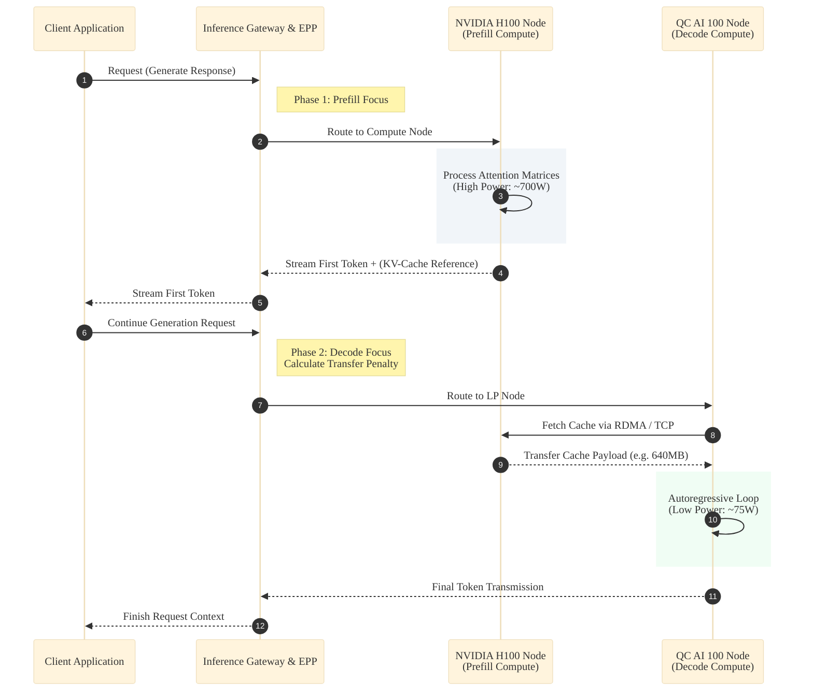

# Thesis Diagrams (Professional Academic Styling)

## 1. System Architecture: Control and Data Planes

**Caption**: *Figure 1: High-level architecture of the energy-aware LLM inference serving system. The system integrates via the Kubernetes Gateway API Inference Extension. Request routing (control plane) intersects with telemetry ingestion (data plane) at the Endpoint Picker Plugin (EPP).*

---

## 2. EPP Scheduling Execution Pipeline

**Caption**: *Figure 2: Execution pipeline of the energy-aware Endpoint Picker Plugin. The scheduling process evaluates candidate pods through a sequence of hard constraints (filters) followed by soft, multi-objective normalisation (batch scorers).*

---

## 3. Phase-Aware Objective Weighting

**Caption**: *Figure 3: Phase-aware scheduling logic differentiating between compute-bound (prefill) and memory-bound (decode) phases. The weight matrix dynamically shifts to prioritise latency for prefix processing and energy savings during autoregressive decoding.*

---

## 4. Adaptive Controller: Multi-State Automation

**Caption**: *Figure 4: Finite State Machine of the Adaptive Weight Controller. A 30-second control loop continuously evaluates grid carbon intensity ($\text{gCO}_2\text{eq/kWh}$) and cluster power consumption to dynamically transition between optimisation strategies.*

---

## 5. Thread-Safe Telemetry Concurrency Model

**Caption**: *Figure 5: Data ingestion sequence illustrating thread-safety mechanisms. The system entirely decouples high-frequency background data polling tasks (telemetry scrapers) from the latency-sensitive Request Scheduling loop utilizing `sync.RWMutex` locking mechanisms.*

---

## 6. Mathematical SLO $\epsilon$-Constraint Flow

**Caption**: *Figure 6: Flowchart detailing the implementation of the $\epsilon$-constraint filter, enforcing Service Level Objectives (SLOs). Prefill routing is gated by maximum Time-To-First-Token (TTFT), whilst decoding is gated by maximum Time-Per-Output-Token (TPOT).*

---

## 7. KV-Cache Cross-Node Transfer Operations

**Caption**: *Figure 7: Disaggregated sequence illustrating phase transition from prefill node to decode node. The `KVCacheTransferScorer` calculates an energy penalty associated with the transfer across the network fabric, balancing transfer cost against targeted decode efficiency.*

