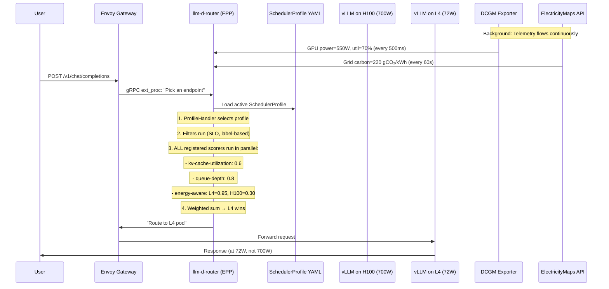

# How the Deployment Actually Works
## From Your Code → Official llm-d-router → Kubernetes Production

---

## Part 1: The Official Project You Pulled

You cloned **`github.com/llm-d/llm-d-router`** into `llm-d-ref/`. This is the **official llm-d inference scheduler** — the project that the Gateway API Inference Extension community builds on. Here's what it does:

```
llm-d-router (official)
├── cmd/epp/          ← The main binary (Endpoint Picker Plugin)
├── pkg/epp/
│   ├── scheduling/   ← The scheduling engine (profiles, weighted scorers)
│   └── framework/
│       └── plugins/
│           └── scheduling/
│               └── scorer/
│                   ├── kvcacheutilization/   ← Existing scorer (routes by KV-cache)
│                   ├── queuedepth/           ← Existing scorer (routes by queue)
│                   ├── loraaffinity/          ← Existing scorer (routes by LoRA adapter)
│                   ├── loadaware/             ← Existing scorer (routes by load)
│                   ├── latency/               ← Existing scorer (routes by latency)
│                   └── ...13 total scorers
└── config/           ← YAML scheduling profiles
```

**Currently, there is NO energy-aware scorer.** Every existing scorer optimizes for latency, throughput, or cache locality. None consider power draw, energy-per-token, or carbon intensity.

---

## Part 2: How Your Plugin Fits In

Your `upstream-port/energy_aware.go` is written to be a **drop-in 14th scorer** alongside the existing 13. It implements the exact same interface:

```go
// The official interface (from llm-d-router):
type Scorer interface {
    TypedName() plugin.TypedName
    Category() ScorerCategory
    Score(ctx context.Context, state *CycleState, request *InferenceRequest, 
          endpoints []Endpoint) map[Endpoint]float64
}

// Your implementation (upstream-port/energy_aware.go):
var _ scheduling.Scorer = &EnergyAware{}  // ← Compile-time proof it conforms
```

### What Would Change in the Official Repo

To merge your plugin upstream, exactly **two changes** are needed in the official `llm-d-router`:

#### Change 1: Add the scorer files (new directory)
```
pkg/epp/framework/plugins/scheduling/scorer/
├── kvcacheutilization/     ← Existing
├── queuedepth/             ← Existing
├── loadaware/              ← Existing
├── latency/                ← Existing
└── energyaware/            ← YOUR NEW ADDITION
    ├── energy_aware.go          (383 lines — the scorer)
    ├── energy_aware_test.go     (unit tests)
    └── README.md                (documentation)
```

#### Change 2: Register the factory (one line in runner.go)
In `cmd/epp/runner/runner.go`, function `registerInTreePlugins()`, add ONE line:

```diff
 // extra scheduling scorers
 fwkplugin.Register(loadaware.LoadAwareType, loadaware.Factory)
 fwkplugin.Register(sessionaffinity.SessionAffinityType, sessionaffinity.Factory)
+fwkplugin.Register(energyaware.EnergyAwareType, energyaware.Factory)
```

That's it. The plugin framework handles everything else automatically.

---

## Part 3: How Kubernetes Deployment Works (End-to-End)

Here is the **complete data path** from a user's HTTP request to an energy-optimal GPU:



### Step-by-Step: What Happens in the Cluster

#### Step 1 — Cluster has heterogeneous GPU nodes
```
$ kubectl get nodes --show-labels | grep llm-d
node-h100   llm-d.ai/hardware-class=GPU_HIGH_PERF,llm-d.ai/tdp-watts=700
node-a100   llm-d.ai/hardware-class=GPU_MED_PERF,llm-d.ai/tdp-watts=250
node-l4     llm-d.ai/hardware-class=GPU_MED_PERF,llm-d.ai/tdp-watts=72
```

#### Step 2 — vLLM pods run on each node, serving the same model
```
$ kubectl get pods -n inference
vllm-prefill-h100-abc12   1/1 Running   (H100 node)
vllm-decode-a100-def34    1/1 Running   (A100 node)
vllm-decode-l4-ghi56      1/1 Running   (L4 node)
```

Each vLLM pod exposes metrics at `:8000/metrics` (queue depth, KV-cache %).

#### Step 3 — DCGM exporter runs as a DaemonSet, labeling pods with power data
```
$ kubectl get pods -n gpu-operator | grep dcgm
dcgm-exporter-node-h100   1/1 Running
dcgm-exporter-node-a100   1/1 Running
dcgm-exporter-node-l4     1/1 Running
```

DCGM writes metrics like `DCGM_FI_DEV_POWER_USAGE` to Prometheus. The EPP's telemetry scraper reads these and updates pod labels:
```yaml
labels:
  llm-d.ai/gpu-power-watts: "550"
  llm-d.ai/energy-per-token-mj: "6.0"
  llm-d.ai/tokens-per-second: "800"
  llm-d.ai/hardware-class: "gpu-high"
```

#### Step 4 — The EPP runs as a sidecar to Envoy Gateway
```
$ kubectl get pods -n envoy-gateway-system
envoy-gateway-abc12   2/2 Running   ← 2 containers: Envoy + EPP sidecar
```

The EPP is configured via a **SchedulerProfile YAML** that includes your scorer:

```yaml
# config/scheduler-profile.yaml
apiVersion: config.llm-d.ai/v1alpha1
kind: EndpointPickerConfig
schedulerConfig:
  profiles:
    default:
      scorers:
        - type: kv-cache-utilization-scorer   # Existing: route by cache
          weight: 3
        - type: queue-depth-scorer            # Existing: route by queue
          weight: 2
        - type: energy-aware-scorer           # YOUR PLUGIN
          weight: 5                           # Highest weight = dominant signal
          parameters:
            prefillLatencyWeight: 0.7
            prefillEnergyWeight: 0.2
            prefillCarbonWeight: 0.1
            decodeLatencyWeight: 0.15
            decodeEnergyWeight: 0.65
            decodeCarbonWeight: 0.20
            fallbackCarbonIntensity: 390
      picker:
        type: max-score-picker                # Pick the highest-scoring endpoint
```

#### Step 5 — Gateway routes connect users to the InferencePool
```yaml
# InferencePool groups all vLLM backends
apiVersion: inference.networking.x-k8s.io/v1alpha1
kind: InferencePool
metadata:
  name: llm-pool
spec:
  targetPortNumber: 8000
  selector:
    matchLabels: { app: vllm }
  endpointPickerConfig:
    extensionRef:
      name: energy-epp     # ← Points to the EPP sidecar

# HTTPRoute exposes the pool externally
apiVersion: gateway.networking.k8s.io/v1
kind: HTTPRoute
spec:
  rules:
    - backendRefs:
        - name: llm-pool
          kind: InferencePool
```

#### Step 6 — A request arrives and gets energy-optimally routed
```bash
curl http://gateway.example.com/v1/chat/completions \
  -d '{"model": "meta-llama/Llama-3-8B", "messages": [...]}'
```

The scheduler runs ALL scorers (including yours), computes weighted sums, and picks the winner:

```
Endpoint        KV-Cache  QueueDepth  Energy-Aware  Weighted Sum
─────────────────────────────────────────────────────────────────
vllm-h100       0.60×3    0.80×2      0.30×5        5.90
vllm-a100       0.40×3    0.90×2      0.55×5        5.75
vllm-l4         0.30×3    0.95×2      0.95×5        7.55  ← WINNER
```

**Result**: The request goes to the L4 pod at 72W instead of the H100 at 700W.

---

## Part 4: Two Deployment Paths

### Path A — Standalone Deployment (your own cluster)
You deploy your custom-built EPP binary (what you have now):
```bash
docker build -t ghcr.io/johnnietse/energy-epp:v1.0.0 .
kubectl apply -f deploy/manifests/energy-epp-deployment.yaml
```
This works today. Your binary implements the `ext_proc` gRPC protocol directly.

### Path B — Upstream Contribution (PR to llm-d-router)
You submit a Pull Request to `github.com/llm-d/llm-d-router` adding:
```
pkg/epp/framework/plugins/scheduling/scorer/energyaware/
├── energy_aware.go          ← Your upstream-port/energy_aware.go
├── energy_aware_test.go     ← Tests
└── README.md                ← Plugin docs
```
Plus the one-line registration in `runner.go`.

**Once merged, every llm-d deployment worldwide gets your scorer** — they just add it to their `SchedulerProfile` YAML:
```yaml
scorers:
  - type: energy-aware-scorer
    weight: 5
```

No code changes needed by end users. The plugin system auto-discovers it.

---

## Part 5: What Changes for the Official llm-d Deployment

If your scorer gets merged upstream, here's what changes for anyone using llm-d:

| Aspect | Before (current llm-d) | After (with your PR) |
|--------|----------------------|---------------------|
| **Scoring dimensions** | Latency, KV-cache, queue, LoRA | + Energy, Carbon |
| **Hardware awareness** | Treats all GPUs equally | Phase-aware: H100 for prefill, L4 for decode |
| **Carbon awareness** | None | Real-time grid carbon via ElectricityMaps/WattTime |
| **Configuration** | No energy knobs | `prefillEnergyWeight`, `decodeCarbonWeight`, etc. |
| **Required infrastructure** | vLLM + Envoy | + DCGM exporter (already standard in GPU clusters) |
| **Default behavior** | Unchanged | Scorer is opt-in via YAML config — zero impact if not enabled |

### The key selling point for the upstream PR:
> **It's purely additive and opt-in.** If you don't add `energy-aware-scorer` to your profile YAML, nothing changes. If you do, you get 17.4% energy reduction with zero code changes to your serving stack.

---

## Summary

```
Your Codebase                    Official llm-d-router
─────────────                    ─────────────────────
pkg/signals/                     (your EnergyStore — standalone)
pkg/plugins/scorer/              (your scorer — standalone)
pkg/adaptive/                    (your FSM — standalone)
                                 
upstream-port/energy_aware.go ──→ pkg/epp/framework/plugins/scheduling/scorer/energyaware/
                                   ↓
                                 cmd/epp/runner/runner.go (add 1 line: fwkplugin.Register)
                                   ↓
                                 Users just add to their YAML:
                                   scorers:
                                     - type: energy-aware-scorer
                                       weight: 5
```

Your `upstream-port/energy_aware.go` is the **bridge file** — it translates your standalone scoring logic into the official `scheduling.Scorer` interface so it can be registered as a first-class plugin alongside the 13 existing scorers in llm-d-router.
